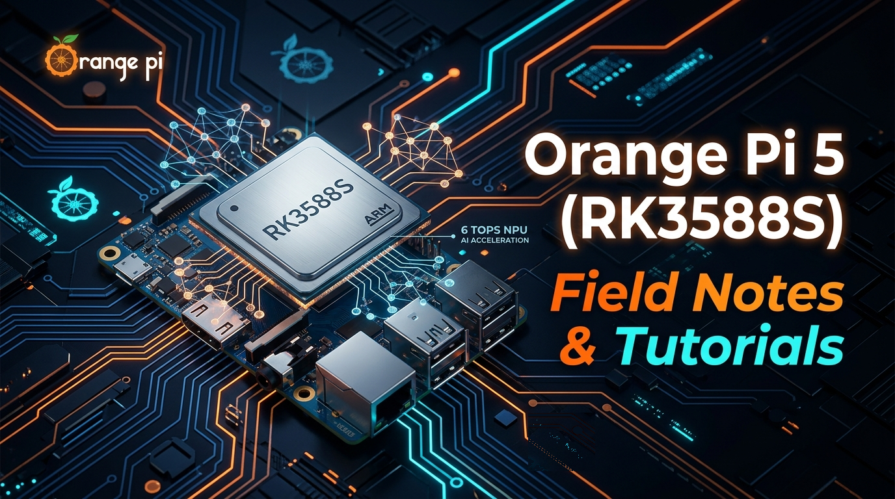

# 🍊 Orange Pi 5 (RK3588S) Field Notes & Tutorials

<div align="center">
  
</div>

<br/>

[](https://github.com/muhammetmucahitsoylu/orangepi5-tutorials/actions)
[](#)
[](#)
[](#)
[](LICENSE)
[](#)
[](CONTRIBUTING.md)

[Türkçe](#türkçe) | [English](#english)

---

## Türkçe

Rockchip RK3588S işlemcili Orange Pi 5 tek kart bilgisayarı için hem donanım üzerinde bizzat deneyimlenen saha çözümlerini hem de ekosistemdeki kronik sorunlara yönelik neden-sonuç analizlerini içeren, yaşayan açık kaynaklı bir başvuru kaynağıdır.

> [!NOTE]
> **Donanım Özeti (Orange Pi 5 - RK3588S):**
> * **İşlemci (CPU):** 8 Çekirdek (4x Cortex-A76 @ 2.4GHz + 4x Cortex-A55 @ 1.8GHz)
> * **Yapay Zeka (NPU):** 6 TOPS (3 Çekirdek, INT4/INT8/INT16/FP16 desteği)
> * **Grafik (GPU):** ARM Mali-G610 MP4 (Vulkan 1.2, OpenGL ES 3.2, OpenCL 2.2)
> * **Video (VPU):** 8K@60fps H.265/VP9/AVS2 donanımsal çözücü, 8K@30fps H.265 kodlayıcı
> * **Depolama:** M.2 PCIe 2.0 x1 NVMe SSD yuvası + MicroSD kart

### 🧩 Kart Uyumluluk Matrisi (Orange Pi 5 Ailesi)

Bu depodaki rehberler Orange Pi 5 (RK3588S) temel alınarak hazırlanmıştır; ancak Rockchip RK3588/RK3588S mimarisini paylaşan diğer kartlarla olan uyumluluk durumu aşağıda özetlenmiştir:

| Model | SoC | NPU & GPU | Depolama | Ağ & Bağlantı | Rehber Uyumluluğu |
| :--- | :--- | :--- | :--- | :--- | :--- |
| **Orange Pi 5** | RK3588S | 6 TOPS / Mali-G610 | M.2 PCIe 2.0 x1 (2242) + MicroSD | 1x GbE LAN (Dahili WiFi yok) | **%100 Tam Uyumlu** (Referans Kart) |
| **Orange Pi 5B** | RK3588S | 6 TOPS / Mali-G610 | Dahili eMMC + MicroSD (M.2 yuvası yok) | 1x GbE LAN + WiFi 6 / BT 5.0 | AI/NPU ve Docker rehberleri tam uyumlu; NVMe boot rehberi yerine dahili eMMC kullanılır. |
| **Orange Pi 5 Pro** | RK3588S | 6 TOPS / Mali-G610 | M.2 PCIe 2.0 x1 (2280) + MicroSD | 1x GbE LAN + WiFi 5/6 + BT | AI/NPU rehberleri tam uyumlu; standart 2280 SSD destekler. 40-pin GPIO pin numaraları kontrol edilmelidir. |
| **Orange Pi 5 Plus** | **RK3588** (Tam) | 6 TOPS / Mali-G610 | M.2 PCIe 3.0 x4 (2280) + eMMC yuvası | 2x 2.5 GbE LAN + M.2 E-Key (WiFi) | AI/NPU rehberleri tam uyumlu; NVMe hızı ~3500 MB/s'ye çıkar, çift 2.5G ağ ile sunucu projelerine mükemmel uyum sağlar. |

---

### ⚡ Hızlı Donanım Teşhis Aracı (One-Line Health Check)

Orange Pi 5 kartınızın CPU frekanslarını, çekirdek sıcaklıklarını, 6 TOPS NPU sürücü durumunu, Mali-G610 GPU/VPU düğümlerini ve NVMe PCIe hat hızını tek satırda doğrulamak için terminalde çalıştırın:

```bash
curl -sSL https://raw.githubusercontent.com/muhammetmucahitsoylu/orangepi5-tutorials/main/scripts/check_health.sh | bash
```
> [!TIP]
> Bu script sisteme hiçbir harici paket yüklemez; salt okunur olarak `/dev/rknpu`, thermal zonelar ve DVFS governor durumlarını tarayıp anında renkli bir sistem teşhis tablosu basar.

---

### 📚 Kılavuzlar ve Rehberler

| Kılavuz | Açıklama |
| :--- | :--- | 
| [**01. SPI Flash & U-Boot Kurtarma / NVMe Boot**](guides/Turkish/01-Kurtarma-ve-NVMe-Kurulum.md) | EDK2 UEFI kilitlenmesinden resmi U-Boot'a dönüş, MaskROM onarımı ve M.2 NVMe SSD'ye doğrudan ağ üzerinden yazım. |
| [**02. Donanım & Aksesuar Uyumluluk Rehberi**](guides/Turkish/02-Donanim-ve-Aksesuar-Uyumluluk.md) | 5V/4A güç beslemesi, M.2 PCIe 2.0 x1 hat sınırları, uyumlu NVMe modelleri ve termal çözümler. |
| [**03. Donanım Doğrulama & Stres Testi Rehberi**](guides/Turkish/03-Donanim-Dogrulama-ve-Stres-Testi.md) | CPU tepe güç ölçümü, RAM bant genişliği, fio ile NVMe hız testi ve termal kararlılık doğrulama protokolü. |
| [**04. Sabit MAC & IP Yapılandırma Rehberi**](guides/Turkish/04-Sabit-MAC-ve-Statik-IP.md) | Her yeniden başlamada rastgele değişen MAC adresi sorununu teşhis etme ve NetworkManager ile kalıcı statik IP atama. |
| [**05. Ekransız (Headless) Sunucu Rehberi**](guides/Turkish/05-Ekransiz-Sunucu-Optimizasyonu.md) | 7/24 ev sunucusu için GUI kapatma (500MB+ RAM kazanımı), ZRAM sıkıştırılmış takas alanı, NTP ve kalıcı governor servisi. |
| [**06. Docker & Donanım Hızlandırma Rehberi**](guides/Turkish/06-Docker-ve-Donanim-Hizlandirma.md) | Dağıtıma göre cgroup bellek uyarısı çözümü ve Jellyfin/Plex için VPU/GPU donanımsal transcode izinleri. |
| [**07. Tarayıcı & Video Hızlandırma Rehberi**](guides/Turkish/07-Tarayici-ve-VPU-Hizlandirma.md) | Chromium'da donanımsal VPU hızlandırma açma, 4K YouTube takılmalarını önleme ve CPU yükünü düşürme. |
| [**08. Uzaktan Erişim & Masaüstü Bağlantı Rehberi**](guides/Turkish/08-Uzaktan-Erisim-ve-Masaustu.md) | SSH/CMD terminal bağlantısı, şifresiz SSH anahtarı, UART seri port (1.5M baud) ve Windows RDP/VNC/NoMachine ile masaüstü kontrolü. |

---

### 🚀 Yazılımcı Projeleri ve Yapay Zeka Rehberleri

| Kategori | No | Proje / Rehber | Açıklama |
| :--- | :--- | :--- | :--- | 
| 🛠️ **Geliştirme** | **01** | [**IDE ve Geliştirme Ortamı Kurulumu**](projects/Turkish/01-IDE-ve-Gelistirme-Ortami.md) | VS Code Remote - SSH, tarayıcı tabanlı Code-Server, Python sanal ortamı (venv) ve proje mimarisi. |
| 🤖 **Edge AI** | **02** | [**NPU Aktivasyonu & RKNN Kurulumu**](projects/Turkish/02-NPU-Aktivasyonu-ve-RKNN.md) | 3 çekirdekli 6 TOPS NPU'yu uyandırma, librknpu2 entegrasyonu, RKNN-Lite2 ve 3 çekirdek telemetri testi. |
| 🤖 **Edge AI** | **03** | [**İlk Yapay Zeka Projesi: YOLOv8 NPU**](projects/Turkish/03-YOLOv8-NPU-Cikarimi.md) | Bilgisayarda ONNX/RKNN derleme, 3 çekirdekli NPU ile 70+ FPS nesne tanıma ve donanım kıyaslaması. |
| 🤖 **Edge AI** | **04** | [**Canlı Kamera & NPU Görü İşleme Pipeline**](projects/Turkish/04-Canli-Kamera-NPU-Pipeline.md) | USB/RTSP kamera akışı, çoklu iş parçacığıyla sıfır gecikmeli kare yakalama, 3 çekirdek NPU YOLOv8 tespiti ve Flask MJPEG web yayını. |
| 🤖 **Edge AI** | **05** | [**NPU ile Yerel Dil Modeli (RKLLM / Qwen)**](projects/Turkish/05-Yerel-LLM-Qwen-RKLLM.md) | 6 TOPS NPU üzerinde internetsiz Qwen-1.5B/3B çalıştırma, W4A16 kuantizasyon, 18+ token/s akıcı sohbet. |
| 🤖 **Edge AI** | **06** | [**Çevrimdışı Sesli Asistan (Whisper & Piper)**](projects/Turkish/06-Sesli-Asistan-Whisper-Piper.md) | %100 yerel sesli asistan: faster-whisper (STT) + RKLLM zekası + Piper TTS doğal Türkçe ses sentezi (<1s gecikme). |
| 🦾 **Robotik** | **07** | [**ROS 2 Kurulumu & NPU Robotik Düğüm**](projects/Turkish/07-ROS2-ve-NPU-Robotik-Dugum.md) | ROS 2 Humble kurulumu, DDS ağ optimizasyonu, 6 TOPS NPU ile nesne algılama düğümü ve navigasyon koordinat yayını. |
| ⚙️ **Gömülü** | **08** | [**Donanım Kontrolü ve GPIO / C++**](projects/Turkish/08-GPIO-ve-Donanim-Kontrolu.md) | 26-pin başlık şeması, wiringOP ile C++/CMake mimarisi, buton/LED kontrolü, libgpiod ve I2C sensörleri. |
| ⚙️ **Gömülü** | **09** | [**Çapraz Derleme & Uzaktan Hata Ayıklama (GDB)**](projects/Turkish/09-Capraz-Derleme-ve-GDB.md) | x86_64 PC'de ARM64 GNU toolchain ve CMake ile derleme, rsync otomatik yükleme, gdbserver ve VS Code ile uzaktan F5 debug. |
| ⚙️ **Gömülü** | **10** | [**Linux Çekirdek Modülü (LKM) ve Aygıt Sürücüsü**](projects/Turkish/10-Linux-Cekirdek-Modulu-LKM.md) | Rockchip kernel headers kurulumu, Ring 0 / Ring 3 mimarisi, misc karakter sürücüsü ile GPIO donanım kontrolü ve Kbuild Makefile. |
| 🌐 **Sunucu & Ağ** | **11** | [**Kişisel Bulut & Jellyfin VPU Medya Sunucusu**](projects/Turkish/11-Kisisel-Bulut-Jellyfin.md) | NVMe üzerinde CasaOS, telefon fotoğraflarını otomatik yedekleme (Nextcloud), 4K VPU donanımsal transcode (Jellyfin) ve Samba. |
| 🌐 **Sunucu & Ağ** | **12** | [**Ağ Güvenlik Kalkanı (AdGuard, Unbound, Tailscale)**](projects/Turkish/12-Ag-Guvenlik-Kalkani.md) | Tüm ev için donanımsal reklam/izleyici kalkanı, İSS kaydını önleyen Unbound kök DNS ve dışarıdan güvenli erişim için Tailscale VPN. |
| 🎮 **Multimedya** | **13** | [**Retro Oyun Konsolu (PS2, PSP, GameCube)**](projects/Turkish/13-Retro-Oyun-Konsolu.md) | Mali-G610 GPU ve Vulkan hızlandırma ile 1080p 60FPS PS2 (AetherSX2), PSP, GameCube emülasyonu ve DualShock 3/4 kol eşleşmesi. |

---

### 🛠️ Kılavuz İlkeleri ve Objektiflik Yaklaşımı

* **Şeffaf ve Objektif Mühendislik:** Kulaktan dolma veya yapay zeka tarafından ezbere yazılmış varsayımlar yerine; çözülmüş eski hatalar (örn. yeni çekirdeklerde giderilen MAC adresi bug'ı) veya donanım limitleri (PCIe 2.0 x1 darboğazı, USB YUYV 5 FPS kilidi) açıkça belirtilmiştir.
* **Hata Odaklı Sorun Giderme (Error-Driven Troubleshooting):** Her kılavuzda *"Şu hata alınırsa kök neden şudur, şu adımı uygulayın"* şeklinde teşhis haritaları bulunur.
* **Dağıtım ve Kernel Farkındalığı:** Çözümler Ubuntu 22.04 LTS ve Rockchip BSP çekirdeği (Linux 5.10.x / 6.1.x) temel alınarak yapılandırılmıştır; Armbian veya farklı çekirdeklerdeki ayrışmalar açıkça vurgulanmıştır.
* **Firmware ve Donanım Analizi:** Sorunun sadece nasıl çözüleceği değil; MaskROM, PCIe hatları ve SPI Flash mimarisi seviyesindeki teknik nedenleri açıklanır.

---

### ❓ Sıkça Sorulan Sorular (SSS)

<details>
<summary><b>1. Kart ağır yük altındayken (YOLOv8, LLM, C++ derleme) neden aniden kapanıyor veya yeniden başlıyor?</b></summary>

* **Kök Neden:** Yetersiz güç beslemesi (Brownout Reset). RK3588S sekiz çekirdek ve NPU tam yük altındayken 15W-18W anlık tepe gücü çekebilir. Standart telefon şarj aletleri (5V/2A veya kalitesiz kablolar) voltajın anlık olarak 4.6V altına düşmesine neden olur.
* **Çözüm:** En az **5V/4A (20W)** değerinde kaliteli, sabit voltaj sağlayan bir güç adaptörü ve kalın iletkenli Type-C kablosu kullanın.
</details>

<details>
<summary><b>2. Pasif alüminyum soğutucu tek başına yeterli mi, aktif fan şart mı?</b></summary>

* **Kök Neden:** Pasif soğutucu boştayken (idle 45-50°C) yeterlidir; ancak yapay zeka çıkarımlarında veya C++ derlemelerinde çip sıcaklığı 30 saniye içinde 80°C üzerine çıkar. Bu durumda işlemci frekans kısma (thermal throttling) devreye girerek performansı yarı yarıya düşürür.
* **Çözüm:** Kesintisiz 2.4 GHz tepe frekansı ve NPU kararlılığı için mutlaka **aktif fan** (5V/3.3V GPIO pinine bağlı veya PWM kontrollü) kullanılmalıdır.
</details>

<details>
<summary><b>3. Hangi işletim sistemini kurmalıyım? (Ubuntu vs Armbian vs Resmi İmaj)</b></summary>

* **NPU / Yapay Zeka Geliştirme İçin:** Rockchip BSP çekirdeği (Linux 5.10.x veya 6.1.x) kullanan **Ubuntu 22.04 LTS (Joshua Riek sürümü)** veya **Resmi Orange Pi OS (Ubuntu tabanlı)** önerilir.
* **Sunucu / Minimal Kullanım İçin:** **Armbian Minimal** veya Joshua Riek Server imajı tercih edilebilir.
* **Önemli Not:** Ana hat (Mainline Vanilla Linux 6.x) çekirdeklerde RKNPU sürücüsü ve VPU donanımsal video hızlandırma henüz tam entegre edilmediği için AI ve video projelerinde BSP çekirdeği zorunludur.
</details>

<details>
<summary><b>4. Neden MicroSD yerine doğrudan NVMe SSD tercih edilmelidir?</b></summary>

MicroSD kartlar rastgele 4K yazma işlemlerinde (loglar, Docker katmanları, veritabanı) 1-5 MB/s gibi çok düşük hızlara düşerek sistem kilitlenmelerine (I/O wait) ve kartın erken bozulmasına yol açar. M.2 NVMe SSD ise PCIe 2.0 x1 arayüzünde bile ~400 MB/s sıralı hız ve on binlerce IOPS sağlayarak sistem yanıt hızını masaüstü bilgisayar seviyesine ulaştırır.
</details>

---

### 🤝 Katkıda Bulunma ve Geri Bildirim

Bu depo, Orange Pi 5 ekosistemindeki geliştiricilerin karşılaştığı engelleri aşması için hazırlanan yaşayan bir açık kaynak kılavuzdur.
* Farklı bir çekirdek (kernel) veya dağıtım sürümünde mi test ettiniz?
* Kılavuzlarda eksik, hatalı veya güncelliğini yitirmiş bir komut mu fark ettiniz?
* Yeni bir proje veya optimizasyon öneriniz mi var?

Lütfen katkı kuralları için **[CONTRIBUTING.md](CONTRIBUTING.md)** dosyasını inceleyin, deneyiminizi paylaşmak için bir **[Issue](https://github.com/muhammetmucahitsoylu/orangepi5-tutorials/issues/new/choose)** açın veya doğrudan bir **Pull Request (PR)** gönderin.

---

### 📁 Dizin Yapısı

```
OrangePi5_Tutorials/
├── .github/
│   ├── ISSUE_TEMPLATE/
│   │   ├── bug_report.yml
│   │   └── feature_request.yml
│   └── workflows/
│       └── ci.yml
├── .gitignore
├── CONTRIBUTING.md
├── LICENSE
├── README.md
├── assets/
│   └── social-preview.png
├── guides/
│   ├── English/
│   │   ├── 01-Recovery-and-NVMe-Installation.md
│   │   ├── 02-Hardware-and-Accessory-Compatibility.md
│   │   ├── 03-Hardware-Verification-and-Stress-Testing.md
│   │   ├── 04-Fixed-MAC-and-Static-IP.md
│   │   ├── 05-Headless-Server-Optimization.md
│   │   ├── 06-Docker-and-Hardware-Acceleration.md
│   │   ├── 07-Browser-and-VPU-Acceleration.md
│   │   └── 08-Remote-Access-and-Desktop-Connection.md
│   ├── Turkish/
│   │   ├── 01-Kurtarma-ve-NVMe-Kurulum.md
│   │   ├── 02-Donanim-ve-Aksesuar-Uyumluluk.md
│   │   ├── 03-Donanim-Dogrulama-ve-Stres-Testi.md
│   │   ├── 04-Sabit-MAC-ve-Statik-IP.md
│   │   ├── 05-Ekransiz-Sunucu-Optimizasyonu.md
│   │   ├── 06-Docker-ve-Donanim-Hizlandirma.md
│   │   ├── 07-Tarayici-ve-VPU-Hizlandirma.md
│   │   └── 08-Uzaktan-Erisim-ve-Masaustu.md
│   └── assets/
├── projects/
│   ├── English/
│   │   ├── 01-IDE-and-Dev-Environment.md
│   │   ├── 02-NPU-Activation-and-RKNN.md
│   │   ├── 03-YOLOv8-NPU-Inference.md
│   │   ├── 04-Real-Time-Camera-NPU-Pipeline.md
│   │   ├── 05-Local-LLM-Qwen-RKLLM.md
│   │   ├── 06-Offline-Voice-Assistant-Whisper-Piper.md
│   │   ├── 07-ROS2-and-NPU-Robotics-Node.md
│   │   ├── 08-Hardware-Control-GPIO-Cpp.md
│   │   ├── 09-Cross-Compilation-and-GDB.md
│   │   ├── 10-Linux-Kernel-Module-Driver.md
│   │   ├── 11-Personal-Cloud-Jellyfin.md
│   │   ├── 12-Network-Shield-AdGuard-Tailscale.md
│   │   └── 13-Retro-Gaming-Console.md
│   └── Turkish/
│       ├── 01-IDE-ve-Gelistirme-Ortami.md
│       ├── 02-NPU-Aktivasyonu-ve-RKNN.md
│       ├── 03-YOLOv8-NPU-Cikarimi.md
│       ├── 04-Canli-Kamera-NPU-Pipeline.md
│       ├── 05-Yerel-LLM-Qwen-RKLLM.md
│       ├── 06-Sesli-Asistan-Whisper-Piper.md
│       ├── 07-ROS2-ve-NPU-Robotik-Dugum.md
│       ├── 08-GPIO-ve-Donanim-Kontrolu.md
│       ├── 09-Capraz-Derleme-ve-GDB.md
│       ├── 10-Linux-Cekirdek-Modulu-LKM.md
│       ├── 11-Kisisel-Bulut-Jellyfin.md
│       ├── 12-Ag-Guvenlik-Kalkani.md
│       └── 13-Retro-Oyun-Konsolu.md
└── scripts/
    ├── check_health.sh
    └── setup_npu.sh
```

---

### 📄 Lisans

Bu projedeki tüm kılavuzlar ve içerikler **Creative Commons Attribution-NonCommercial-NoDerivatives 4.0 International ([CC BY-NC-ND 4.0](LICENSE))** lisansı ile korunmaktadır.
* **Kişisel Kullanım & Uygulama:** Serbesttir.
* **Paylaşım:** Yazar (`Muhammet Mücahit Soylu`) ve orijinal depo bağlantısı belirtilerek serbesttir.
* **Türev İçerik Üretimi & Ticari Kullanım:** Yasaktır (içerik değiştirilerek başka platformlarda kendi eseri gibi yayımlanamaz veya ticari amaçla kullanılamaz).

---

## English

A living, objective open-source engineering knowledge base for the Orange Pi 5 (Rockchip RK3588S), covering hands-on board recovery protocols, root-cause analyses of chronic ecosystem quirks, and edge AI workloads.

> [!NOTE]
> **Hardware Quick Specs (Orange Pi 5 - RK3588S):**
> * **CPU:** 8-Core (4x Cortex-A76 @ 2.4GHz + 4x Cortex-A55 @ 1.8GHz)
> * **NPU:** 6 TOPS (3 Cores, INT4/INT8/INT16/FP16 mixed precision)
> * **GPU:** ARM Mali-G610 MP4 (Vulkan 1.2, OpenGL ES 3.2, OpenCL 2.2)
> * **VPU:** 8K@60fps H.265/VP9/AVS2 hardware decoder, 8K@30fps H.265 encoder
> * **Storage:** M.2 PCIe 2.0 x1 NVMe slot + MicroSD card

### 🧩 Board Compatibility Matrix (Orange Pi 5 Family)

While this repository is authored and benchmarked against the baseline Orange Pi 5 (RK3588S), compatibility across the broader Rockchip RK3588/RK3588S board family is detailed below:

| Model | SoC | NPU & GPU | Storage | Networking | Guide Compatibility |
| :--- | :--- | :--- | :--- | :--- | :--- |
| **Orange Pi 5** | RK3588S | 6 TOPS / Mali-G610 | M.2 PCIe 2.0 x1 (2242) + MicroSD | 1x GbE LAN (No onboard WiFi) | **100% Fully Compatible** (Reference Board) |
| **Orange Pi 5B** | RK3588S | 6 TOPS / Mali-G610 | Onboard eMMC + MicroSD (No M.2 slot) | 1x GbE LAN + WiFi 6 / BT 5.0 | All AI/NPU and Docker guides fully compatible; flash to eMMC instead of NVMe. |
| **Orange Pi 5 Pro** | RK3588S | 6 TOPS / Mali-G610 | M.2 PCIe 2.0 x1 (2280) + MicroSD | 1x GbE LAN + WiFi 5/6 + BT | All AI/NPU guides fully compatible. Supports standard 2280 NVMe SSDs; verify 40-pin GPIO pinout. |
| **Orange Pi 5 Plus** | **RK3588** (Full) | 6 TOPS / Mali-G610 | M.2 PCIe 3.0 x4 (2280) + eMMC socket | 2x 2.5 GbE LAN + M.2 E-Key slot | All AI/NPU guides fully compatible. NVMe speeds reach ~3500 MB/s; dual 2.5G LAN excels for server appliances. |

---

### ⚡ One-Line Hardware Diagnostics Utility

To immediately audit your board's live CPU frequencies, thermal zone temperatures, 6 TOPS NPU driver node, Mali-G610 GPU, VPU hardware decoder, and PCIe link width, execute this command on your board:

```bash
curl -sSL https://raw.githubusercontent.com/muhammetmucahitsoylu/orangepi5-tutorials/main/scripts/check_health.sh | bash
```
> [!TIP]
> This read-only audit inspects thermal sensors, DVFS governor states, and `/dev/rknpu` tri-core status without modifying any system configuration.

---

### 📚 Guides & Tutorials

| Guide | Description |
| :--- | :--- | 
| [**01. SPI Flash & U-Boot Recovery / NVMe Boot**](guides/English/01-Recovery-and-NVMe-Installation.md) | Restoring official U-Boot from EDK2 UEFI lockups, MaskROM recovery, and direct network streaming to M.2 NVMe SSD. |
| [**02. Hardware & Accessory Compatibility Guide**](guides/English/02-Hardware-and-Accessory-Compatibility.md) | 5V/4A power supply requirements, M.2 PCIe 2.0 x1 bus limits, compatible NVMe SSDs, and thermal solutions. |
| [**03. Hardware Verification & Stress Testing Guide**](guides/English/03-Hardware-Verification-and-Stress-Testing.md) | CPU prime compute, RAM bandwidth, fio NVMe throughput testing, and thermal saturation verification protocol. |
| [**04. Fixed MAC & Static IP Guide**](guides/English/04-Fixed-MAC-and-Static-IP.md) | Diagnosing randomized MAC addresses across boots and pinning persistent local static IP via NetworkManager. |
| [**05. Headless Server & Optimization Guide**](guides/English/05-Headless-Server-Optimization.md) | 24/7 server setup: disabling GUI (reclaiming 500MB+ RAM), ZRAM swap setup, NTP sync, and boot performance service. |
| [**06. Docker & Hardware Acceleration Guide**](guides/English/06-Docker-and-Hardware-Acceleration.md) | Clean upstream Docker setup, distro-specific cgroup memory limit fixes, and passing VPU/GPU nodes into containers. |
| [**07. Browser & Video Acceleration Guide**](guides/English/07-Browser-and-VPU-Acceleration.md) | Enabling VPU hardware acceleration in Chromium, fixing 4K YouTube stutter, and reducing CPU load. |
| [**08. Remote Access & Desktop Connection Guide**](guides/English/08-Remote-Access-and-Desktop-Connection.md) | Terminal access via SSH/CMD, passwordless SSH keys, UART serial (1.5M baud), and Windows RDP/VNC/NoMachine graphical desktop streaming. |

---

### 🚀 Developer Projects & AI Guides

| Category | No | Project / Guide | Description |
| :--- | :--- | :--- | :--- | 
| 🛠️ **Dev Tools** | **01** | [**IDE & Development Environment Setup**](projects/English/01-IDE-and-Dev-Environment.md) | VS Code Remote - SSH workflow, browser-based Code-Server, isolated Python venvs, and build toolchains. |
| 🤖 **Edge AI** | **02** | [**NPU Activation & RKNN Runtime Setup**](projects/English/02-NPU-Activation-and-RKNN.md) | Waking up the 3-core 6 TOPS NPU, librknpu2 integration, RKNN-Lite2, and multi-core telemetry validation. |
| 🤖 **Edge AI** | **03** | [**First AI Project: YOLOv8 NPU**](projects/English/03-YOLOv8-NPU-Inference.md) | Host-side ONNX/RKNN compilation, 3-core NPU deployment, 70+ FPS object detection, and hardware benchmarks. |
| 🤖 **Edge AI** | **04** | [**Real-Time Camera & NPU Vision Pipeline**](projects/English/04-Real-Time-Camera-NPU-Pipeline.md) | USB/RTSP camera ingestion, multi-threaded zero-latency capture, tri-core NPU YOLOv8 detection, and Flask MJPEG web streaming. |
| 🤖 **Edge AI** | **05** | [**Local LLM on NPU (RKLLM / Qwen)**](projects/English/05-Local-LLM-Qwen-RKLLM.md) | Running offline Qwen-1.5B/3B on the 6 TOPS NPU, W4A16 quantization, and 18+ tokens/sec streaming response. |
| 🤖 **Edge AI** | **06** | [**Offline Voice Assistant (Whisper & Piper)**](projects/English/06-Offline-Voice-Assistant-Whisper-Piper.md) | 100% private voice assistant: faster-whisper (STT) + RKLLM reasoning + Piper TTS neural synthesis (<1s round-trip). |
| 🦾 **Robotics** | **07** | [**ROS 2 Setup & NPU Robotics Node**](projects/English/07-ROS2-and-NPU-Robotics-Node.md) | ROS 2 Humble setup, DDS network tuning, 6 TOPS NPU perception node, and coordinate publishing for Nav2 kinematics. |
| ⚙️ **Embedded** | **08** | [**Hardware Control & GPIO / C++**](projects/English/08-Hardware-Control-GPIO-Cpp.md) | 26-pin header diagram, wiringOP with C++/CMake, button/LED interfacing, libgpiod, and I2C peripherals. |
| ⚙️ **Embedded** | **09** | [**Cross-Compilation & Remote Debugging (GDB)**](projects/English/09-Cross-Compilation-and-GDB.md) | x86_64 host cross-compilation with ARM64 GNU toolchain & CMake, rsync auto-deploy, gdbserver, and VS Code F5 remote debug. |
| ⚙️ **Embedded** | **10** | [**Linux Kernel Module & Device Driver**](projects/English/10-Linux-Kernel-Module-Driver.md) | Rockchip kernel headers setup, Ring 0 vs Ring 3 privilege rings, misc character device driver for GPIO control, and Kbuild. |
| 🌐 **Server & Net** | **11** | [**Personal Cloud & Jellyfin Media Server**](projects/English/11-Personal-Cloud-Jellyfin.md) | CasaOS on NVMe, automatic camera roll sync (Nextcloud), 4K VPU hardware transcoding (Jellyfin), and Samba. |
| 🌐 **Server & Net** | **12** | [**Network Shield (AdGuard, Unbound, Tailscale)**](projects/English/12-Network-Shield-AdGuard-Tailscale.md) | Whole-home ad/tracker sinkhole, zero-ISP-logging recursive Unbound root DNS, and secure remote Tailscale exit node. |
| 🎮 **Multimedia** | **13** | [**Retro Gaming Console (PS2, PSP, GameCube)**](projects/English/13-Retro-Gaming-Console.md) | Mali-G610 GPU with Vulkan acceleration for 1080p 60FPS PS2 (AetherSX2), PSP, GameCube emulation, and controller pairing. |

---

### 🛠️ Guide Principles & Objective Engineering

* **Transparent & Objective Rigor:** Avoids unverified assumptions or generic defaults. Solved bugs (such as fixed MAC address derivation in newer kernels) and physical limits (PCIe 2.0 x1 bus bottlenecks, USB YUYV 5 FPS throttles) are explicitly identified.
* **Error-Driven Troubleshooting:** Every guide provides actionable diagnostic tables mapping common runtime errors directly to their technical root causes and exact command fixes.
* **Distro & Kernel Awareness:** Protocols target Ubuntu 22.04 LTS with Rockchip BSP (Linux 5.10.x / 6.1.x), with explicit caveats for Armbian or mainline kernel divergences.
* **Root-Cause Analysis:** Technical breakdowns covering MaskROM, PCIe bus topology, SPI Flash partitioning, and low-level NPU tensor drivers.

---

### ❓ Frequently Asked Questions (FAQ)

<details>
<summary><b>1. Why does the board suddenly freeze or reboot under heavy load (YOLOv8, LLM, compiling)?</b></summary>

* **Root Cause:** Insufficient power delivery (Brownout Reset). Under full 8-core CPU and 3-core NPU loads, the board can pull 15W-18W transient spikes. Standard smartphone chargers (5V/2A or high-resistance thin cables) cause the voltage rail to dip below 4.6V.
* **Solution:** Always deploy a verified **5V/4A (20W)** dedicated DC/Type-C power supply with heavy-gauge wiring.
</details>

<details>
<summary><b>2. Is a passive heatsink sufficient, or is an active cooling fan mandatory?</b></summary>

* **Root Cause:** A passive heatsink is adequate for idle states (45-50°C), but edge AI inference or parallel compilation saturates the heatsink within seconds, pushing die temperatures past 80°C and triggering thermal throttling.
* **Solution:** For sustained 2.4 GHz compute and stable NPU throughput, an **active fan** (powered via 5V/3.3V GPIO headers or PWM) is strongly recommended.
</details>

<details>
<summary><b>3. Which OS distribution should I install? (Ubuntu vs Armbian vs Official)</b></summary>

* **For Edge AI / NPU / VPU Development:** Distributions based on the Rockchip BSP kernel (Linux 5.10.x or 6.1.x), such as **Ubuntu 22.04 LTS (Joshua Riek build)** or **Official Orange Pi OS (Ubuntu-based)**, are recommended.
* **For Headless / Minimal Server Workloads:** **Armbian Minimal** or Joshua Riek Server builds.
* **Critical Caveat:** Vanilla Mainline Linux (6.x) currently lacks upstream RKNPU driver and VPU acceleration support. For AI and video transcoding, stay on BSP kernels.
</details>

<details>
<summary><b>4. Why should I boot from an NVMe SSD instead of a MicroSD card?</b></summary>

MicroSD cards suffer from dismal random 4K write throughput (often 1-5 MB/s), triggering heavy I/O wait latency and eventual flash cell fatigue from continuous OS logging and Docker containers. An M.2 NVMe SSD achieves ~400 MB/s even over the PCIe 2.0 x1 link with superior IOPS, transforming the board into a desktop-class machine.
</details>

---

### 🤝 Contributing & Community Feedback

This repository is a living open-source reference intended to streamline developer onboarding and hardware exploration on the Rockchip RK3588S.
* Tested these workflows on a different kernel branch or Armbian release?
* Spotted a deprecated package or command syntax?
* Want to contribute a new edge AI or robotics recipe?

Please check out our **[CONTRIBUTING.md](CONTRIBUTING.md)** guidelines, feel free to open an **[Issue](https://github.com/muhammetmucahitsoylu/orangepi5-tutorials/issues/new/choose)**, or submit a **Pull Request (PR)**!

---

### 📁 Directory Structure

```
OrangePi5_Tutorials/
├── .github/
│   ├── ISSUE_TEMPLATE/
│   │   ├── bug_report.yml
│   │   └── feature_request.yml
│   └── workflows/
│       └── ci.yml
├── .gitignore
├── CONTRIBUTING.md
├── LICENSE
├── README.md
├── assets/
│   └── social-preview.png
├── guides/
│   ├── English/
│   │   ├── 01-Recovery-and-NVMe-Installation.md
│   │   ├── 02-Hardware-and-Accessory-Compatibility.md
│   │   ├── 03-Hardware-Verification-and-Stress-Testing.md
│   │   ├── 04-Fixed-MAC-and-Static-IP.md
│   │   ├── 05-Headless-Server-Optimization.md
│   │   ├── 06-Docker-and-Hardware-Acceleration.md
│   │   ├── 07-Browser-and-VPU-Acceleration.md
│   │   └── 08-Remote-Access-and-Desktop-Connection.md
│   ├── Turkish/
│   │   ├── 01-Kurtarma-ve-NVMe-Kurulum.md
│   │   ├── 02-Donanim-ve-Aksesuar-Uyumluluk.md
│   │   ├── 03-Donanim-Dogrulama-ve-Stres-Testi.md
│   │   ├── 04-Sabit-MAC-ve-Statik-IP.md
│   │   ├── 05-Ekransiz-Sunucu-Optimizasyonu.md
│   │   ├── 06-Docker-ve-Donanim-Hizlandirma.md
│   │   ├── 07-Tarayici-ve-VPU-Hizlandirma.md
│   │   └── 08-Uzaktan-Erisim-ve-Masaustu.md
│   └── assets/
├── projects/
│   ├── English/
│   │   ├── 01-IDE-and-Dev-Environment.md
│   │   ├── 02-NPU-Activation-and-RKNN.md
│   │   ├── 03-YOLOv8-NPU-Inference.md
│   │   ├── 04-Real-Time-Camera-NPU-Pipeline.md
│   │   ├── 05-Local-LLM-Qwen-RKLLM.md
│   │   ├── 06-Offline-Voice-Assistant-Whisper-Piper.md
│   │   ├── 07-ROS2-and-NPU-Robotics-Node.md
│   │   ├── 08-Hardware-Control-GPIO-Cpp.md
│   │   ├── 09-Cross-Compilation-and-GDB.md
│   │   ├── 10-Linux-Kernel-Module-Driver.md
│   │   ├── 11-Personal-Cloud-Jellyfin.md
│   │   ├── 12-Network-Shield-AdGuard-Tailscale.md
│   │   └── 13-Retro-Gaming-Console.md
│   └── Turkish/
│       ├── 01-IDE-ve-Gelistirme-Ortami.md
│       ├── 02-NPU-Aktivasyonu-ve-RKNN.md
│       ├── 03-YOLOv8-NPU-Cikarimi.md
│       ├── 04-Canli-Kamera-NPU-Pipeline.md
│       ├── 05-Yerel-LLM-Qwen-RKLLM.md
│       ├── 06-Sesli-Asistan-Whisper-Piper.md
│       ├── 07-ROS2-ve-NPU-Robotik-Dugum.md
│       ├── 08-GPIO-ve-Donanim-Kontrolu.md
│       ├── 09-Capraz-Derleme-ve-GDB.md
│       ├── 10-Linux-Cekirdek-Modulu-LKM.md
│       ├── 11-Kisisel-Bulut-Jellyfin.md
│       ├── 12-Ag-Guvenlik-Kalkani.md
│       └── 13-Retro-Oyun-Konsolu.md
└── scripts/
    ├── check_health.sh
    └── setup_npu.sh
```

---

### 📄 License

All guides and documentation in this repository are protected under the **Creative Commons Attribution-NonCommercial-NoDerivatives 4.0 International ([CC BY-NC-ND 4.0](LICENSE))** license.
* **Personal Learning & Execution:** Free and open.
* **Sharing:** Allowed only with clear attribution to the author (`Muhammet Mücahit Soylu`) and original repository link.
* **Derivative Works & Commercial Exploitation:** Strictly prohibited (materials may not be remixed, altered, republished as personal content, or used for commercial purposes).
