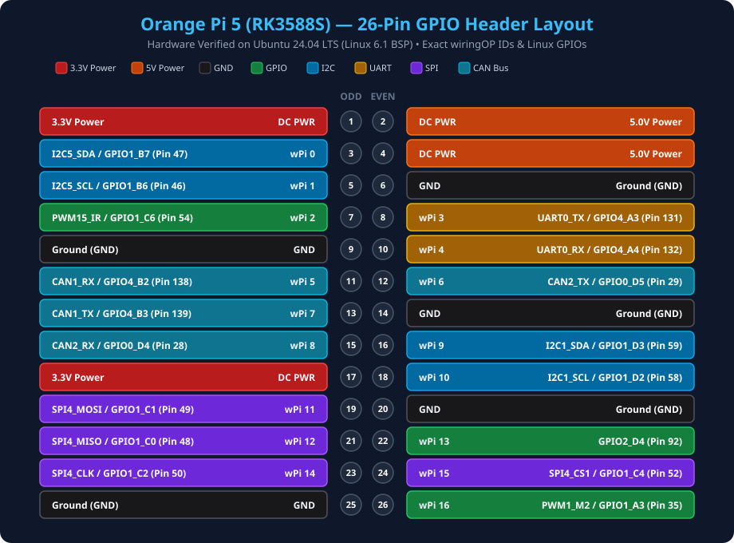

# Orange Pi 5 (RK3588S) 26-Pin GPIO Header Reference & Pinout Guide

> Complete physical pinout mapping, subsystem multiplexing (I2C, SPI, UART, PWM, CAN), and programming cheat sheet for the **Orange Pi 5 (Rockchip RK3588S V1.3.2)** 26-pin expansion header and dedicated 3-pin Debug UART.

---

## 1. Physical 26-Pin & 3-Pin Debug Header Diagram



<p align="center">
  
</p>

### 3-Pin Dedicated Debug UART Wiring (1,500,000 Baud)

When debugging bootloader crashes, kernel panics, or MaskROM recovery, connect a 3.3V USB-to-UART bridge (e.g. CP2102, CH340, FTDI) to the dedicated 3-pin debug header located next to the HDMI port:

```
 Orange Pi 5 Dedicated Debug Header            USB-to-UART Adapter (PC)
+----------------------------------+          +--------------------------+
|  [TX]  ------------------------->---------->|  [RX]                    |
|  [RX]  <-------------------------<----------|  [TX]                    |
|  [GND] (Square Pad ■) ----------->--------->|  [GND]                   |
+----------------------------------+          +--------------------------+
 (DO NOT CONNECT VCC / 3.3V / 5V!)              Settings: 1,500,000 Baud, 8N1
```

> [!CAUTION]
> **Never connect VCC (3.3V or 5V)** between your USB-UART adapter and the Orange Pi 5. Connecting power leads from two different power supplies will cause ground loops and can permanently fry the RK3588S UART pad. Connect **ONLY TX, RX, and GND**.

---

## 2. Comprehensive Pin Mapping Table (Orange Pi 5 V1.3.2)

> [!WARNING]
> **Voltage Warning:** All GPIO data pins on the Orange Pi 5 operate at **3.3V TTL logic levels**. Connecting 5V digital signals directly to any GPIO pin will permanently destroy the SoC I/O pad. Always use a level shifter for 5V peripherals.

| Physical Pin | Default Function | WiringOP ID | Linux `libgpiod` Chip & Offset | Linux Sysfs GPIO Index | Alternate Function 1 | Alternate Function 2 | Alternate Function 3 |
| :---: | :--- | :---: | :--- | :---: | :--- | :--- | :--- |
| **01** | **+3.3V Power** | — | — | — | 3.3V DC Power Rail | — | — |
| **02** | **+5.0V Power** | — | — | — | 5.0V DC Power Rail | — | — |
| **03** | **GPIO1_B7** | **0** | `gpiochip1` Line 15 | **47** | **PWM13_M2** | **UART1_RX_M1** | **I2C5_SDA_M3** |
| **04** | **+5.0V Power** | — | — | — | 5.0V DC Power Rail | — | — |
| **05** | **GPIO1_B6** | **1** | `gpiochip1` Line 14 | **46** | **UART1_TX_M1** | **I2C5_SCL_M3** | — |
| **06** | **Ground (GND)**| — | — | — | 0V Ground Reference | — | — |
| **07** | **GPIO1_C6** | **2** | `gpiochip1` Line 22 | **54** | **PWM15_IR_M2** | — | — |
| **08** | **GPIO4_A3** | **3** | `gpiochip4` Line 3 | **131** | **UART0_TX_M2** | — | — |
| **09** | **Ground (GND)**| — | — | — | 0V Ground Reference | — | — |
| **10** | **GPIO4_A4** | **4** | `gpiochip4` Line 4 | **132** | **UART0_RX_M2** | — | — |
| **11** | **GPIO4_B2** | **5** | `gpiochip4` Line 10 | **138** | **PWM14_M1** | **CAN1_RX_M1** | — |
| **12** | **GPIO0_D5** | **6** | `gpiochip0` Line 29 | **29** | **CAN2_TX_M1** | — | — |
| **13** | **GPIO4_B3** | **7** | `gpiochip4` Line 11 | **139** | **CAN1_TX_M1** | — | — |
| **14** | **Ground (GND)**| — | — | — | 0V Ground Reference | — | — |
| **15** | **GPIO0_D4** | **8** | `gpiochip0` Line 28 | **28** | **PWM3_IR_M0** | **CAN2_RX_M1** | — |
| **16** | **GPIO1_D3** | **9** | `gpiochip1` Line 27 | **59** | **UART4_RX_M0** | **I2C1_SDA_M4** | — |
| **17** | **+3.3V Power** | — | — | — | 3.3V DC Power Rail | — | — |
| **18** | **GPIO1_D2** | **10** | `gpiochip1` Line 26 | **58** | **UART4_TX_M0** | **I2C1_SCL_M4** | **PWM0_M1** |
| **19** | **GPIO1_C1** | **11** | `gpiochip1` Line 17 | **49** | **I2C3_SCL_M0** | **UART3_TX_M0** | **SPI4_MOSI_M0** |
| **20** | **Ground (GND)**| — | — | — | 0V Ground Reference | — | — |
| **21** | **GPIO1_C0** | **12** | `gpiochip1` Line 16 | **48** | **I2C3_SDA_M0** | **UART3_RX_M0** | **SPI4_MISO_M0** |
| **22** | **GPIO2_D4** | **13** | `gpiochip2` Line 28 | **92** | — | — | — |
| **23** | **GPIO1_C2** | **14** | `gpiochip1` Line 18 | **50** | **SPI4_CLK_M0** | — | — |
| **24** | **GPIO1_C4** | **15** | `gpiochip1` Line 20 | **52** | **SPI4_CS1_M0** | — | — |
| **25** | **Ground (GND)**| — | — | — | 0V Ground Reference | — | — |
| **26** | **GPIO1_A3** | **16** | `gpiochip1` Line 3 | **35** | **PWM1_M2** | — | — |

### Dedicated 3-Pin Debug UART Header
Located immediately below the 26-pin header on the Orange Pi 5 PCB:
* **TX:** Rockchip serial debug transmit pin. Connect to your USB-TTL adapter's **RX** pin.
* **RX:** Rockchip serial debug receive pin. Connect to your USB-TTL adapter's **TX** pin.
* **GND:** Ground reference (indicated by the square solder pad). Connect to USB-TTL adapter's **GND**.
* **Baud Rate:** **`1,500,000` (1.5M baud)** strictly.

---

## 3. Sysfs Calculation Formula

In the Linux kernel, global GPIO numbers follow this mathematical formula:
$$\text{GPIO Index} = (\text{Bank Number} \times 32) + (\text{Port Letter} \times 8) + \text{Pin Number}$$
Where:
* **Port Letter Index:** `A = 0`, `B = 1`, `C = 2`, `D = 3`.
* **Example (`GPIO1_C6` / Pin 7):** $(1 \times 32) + (2 \times 8) + 6 = 32 + 16 + 6 = \mathbf{54}$.
* **Example (`GPIO1_D2` / Pin 18):** $(1 \times 32) + (3 \times 8) + 2 = 32 + 24 + 2 = \mathbf{58}$.
* **Example (`GPIO4_B2` / Pin 11):** $(4 \times 32) + (1 \times 8) + 2 = 128 + 8 + 2 = \mathbf{138}$.

---

## 4. Programming Snippets

### A. Bash (`gpiod` Modern Linux Standard)

> [!NOTE]
> **Permissions Note:** Raw hardware access to `/dev/gpiochip*` requires root privileges (`sudo`) or adding your user account to the `gpio` group (`sudo usermod -aG gpio $USER`).

```bash
# Install tool
sudo apt install -y gpiod

# Inspect all available GPIO chips
sudo gpiodetect

# Toggle Pin 7 (GPIO1_C6 -> gpiochip1 Line 22) HIGH then LOW
sudo gpioset gpiochip1 22=1
sleep 1
sudo gpioset gpiochip1 22=0

# Read state of Pin 7 (GPIO1_C6 -> gpiochip1 Line 22)
sudo gpioget gpiochip1 22
```

### B. C++ (`wiringOP`)
```cpp
#include <wiringPi.h>
#include <iostream>

// Physical Pin 7 (GPIO1_C6) corresponds to wiringOP pin 2
#define LED_PIN 2 

int main() {
    if (wiringPiSetup() == -1) {
        std::cerr << "wiringPi initialization failed!" << std::endl;
        return 1;
    }
    
    pinMode(LED_PIN, OUTPUT);
    digitalWrite(LED_PIN, HIGH); // 3.3V Active
    delay(1000);
    digitalWrite(LED_PIN, LOW);  // 0V Inactive
    return 0;
}
```

### C. Python 3 (`gpiod`)

#### For Ubuntu 22.04 LTS (`python3-libgpiod` v1.x):
```python
import gpiod
import time

chip = gpiod.Chip("gpiochip1")
line = chip.get_line(22) # Physical Pin 7 (GPIO1_C6)
line.request(consumer="LED_Test", type=gpiod.LINE_REQ_DIR_OUT)

try:
    line.set_value(1) # HIGH (3.3V)
    time.sleep(1)
    line.set_value(0) # LOW (0V)
finally:
    line.release()
```

#### For Ubuntu 24.04 LTS (`gpiod` v2.x):
```python
import gpiod
import time

# v2 uses context managers and LineSettings
with gpiod.request_lines(
    "/dev/gpiochip1",
    consumer="LED_Test",
    config={22: gpiod.LineSettings(direction=gpiod.line.Direction.OUTPUT)} # Physical Pin 7
) as req:
    req.set_value(22, gpiod.line.Value.ACTIVE)
    time.sleep(1)
    req.set_value(22, gpiod.line.Value.INACTIVE)
```
