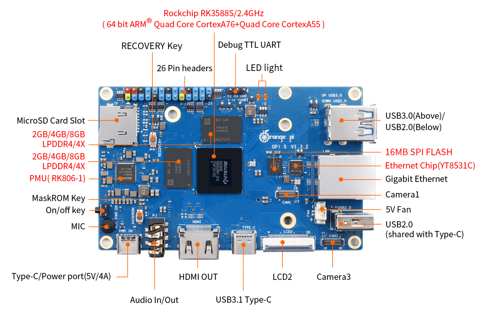
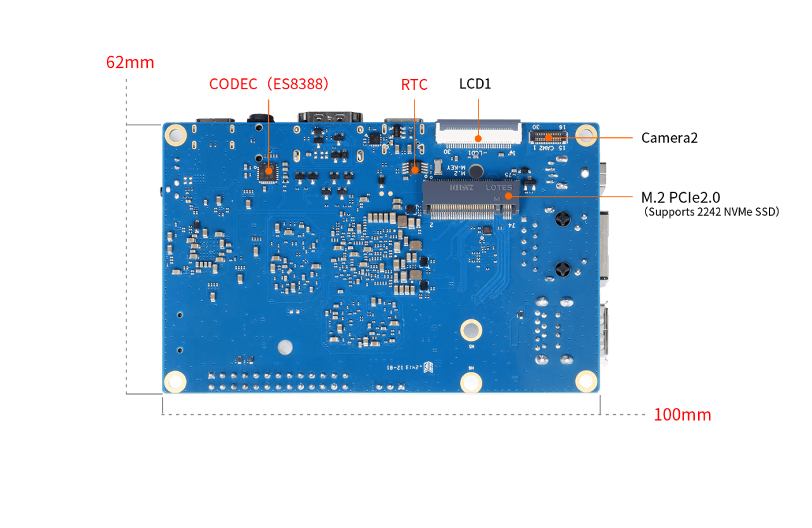
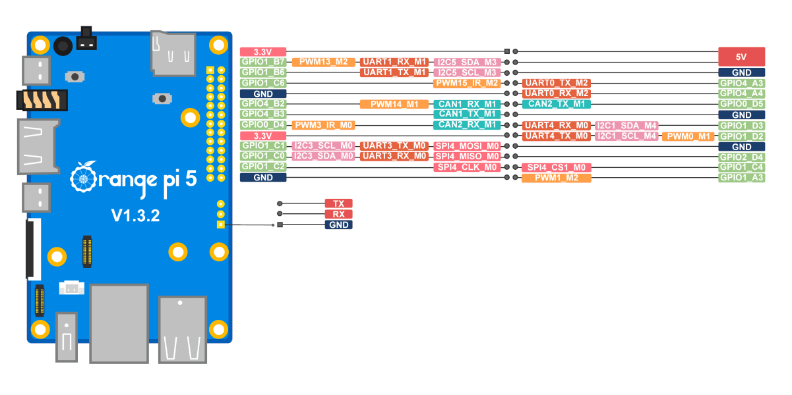
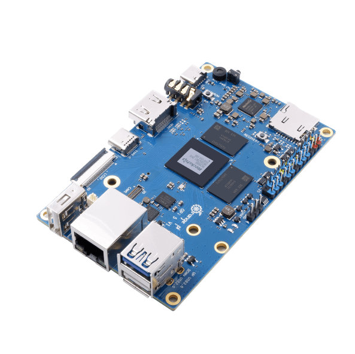
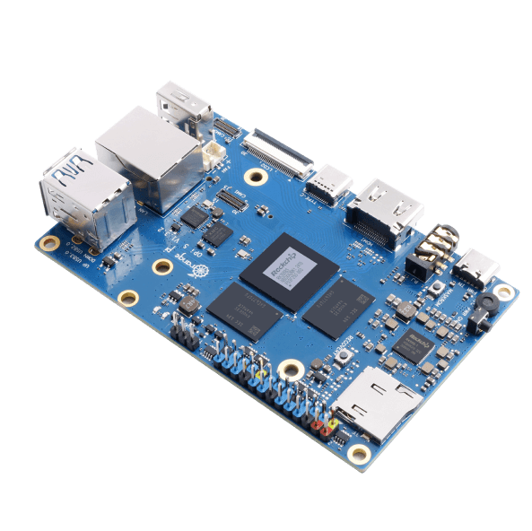

# 📸 Orange Pi 5 (V1.3.2) Physical Hardware Photography & Annotated Schematics

Bu dizin, **Orange Pi 5 (RK3588S V1.3.2)** donanımına ait yüksek çözünürlüklü, oklarla etiketlenmiş fiziksel fotoğrafları ve resmi pin bağlantı şemalarını içerir.

This directory contains high-resolution, arrow-annotated hardware photography and official pinout schematics for the **Orange Pi 5 (Rockchip RK3588S V1.3.2)**.

---

## 📷 Donanım Fotoğraf & Şema Kataloğu | Hardware Visual Catalog

| Görsel / Preview | Dosya / File | Açıklama & Etiketler (TR) | Description & Annotations (EN) |
| :---: | :--- | :--- | :--- |
|  | [`opi5_front.png`](opi5_front.png) | **Ön Yüz (Top View) - Oklarla Etiketli:** • RK3588S 8-Çekirdek 2.4GHz SoC • 2GB/4GB/8GB LPDDR4/4X RAM • PMU (RK806-1 Güç Yönetimi) • **MaskROM Butonu** (Kurtarma modu) • **RECOVERY Butonu** • **16MB SPI FLASH** (U-Boot belleği) • 3-Pin Debug TTL UART (TX, RX, GND) • 26-Pin GPIO Başlığı • 1x GbE LAN (YT8531C Kontrolcü) • USB 3.0 / USB 2.0 Portları • USB 3.1 Type-C + 5V/4A Type-C Güç Girişi • HDMI Çıkışı, 3.5mm Ses Jakı, Mikrofon • CAM1 & CAM3 MIPI Kamera, LCD2 Ekran • 5V Fan ve MicroSD Kart Yuvası | **Front View - Annotated with Arrows:** • Rockchip RK3588S Octa-core 2.4GHz SoC • 2GB/4GB/8GB LPDDR4/4X RAM • RK806-1 Power Management IC (PMU) • **MaskROM Key** (Hardware recovery) • **RECOVERY Key** • **16MB SPI FLASH** (U-Boot storage) • 3-Pin Dedicated Debug TTL UART • 26-Pin Multi-function GPIO Header • 1x GbE LAN (YT8531C controller) • USB 3.0 / USB 2.0 Ports • USB 3.1 Type-C + Type-C DC-IN (5V/4A) • HDMI OUT, 3.5mm Audio In/Out, MIC • CAM1 & CAM3 MIPI CSI, LCD2 MIPI DSI • 5V Fan Connector, MicroSD Slot |
|  | [`opi5_rear.png`](opi5_rear.png) | **Arka Yüz (Bottom View) - Oklarla Etiketli:** • **M.2 PCIe 2.0 M-Key Yuvası** (2242 NVMe SSD desteği) • **ES8388 Ses Kodek Çipi** (Everest Semi) • **RTC Batarya Bağlantısı** (Gerçek Zaman Saati) • **LCD1 MIPI DSI Ekran Portu** • **Camera2 (CAM2 MIPI CSI Portu)** • Kart Fiziksel Boyutları: **100mm x 62mm** | **Rear View - Annotated with Arrows:** • **M.2 PCIe 2.0 M-Key Slot** (Supports 2242 NVMe SSD) • **ES8388 Audio Codec IC** (Everest Semiconductor) • **RTC Connector** (Real-Time Clock battery circuit) • **LCD1 MIPI DSI Display Port** • **Camera2 (CAM2 MIPI CSI Port)** • Physical Board Dimensions: **100mm x 62mm** |
|  | [`opi5_pin_definition.png`](opi5_pin_definition.png) | **Resmi Pin Tanımlama Şeması:** 26-Pin GPIO ve 3-Pin Debug UART portlarının renk kodlu fonksiyon ve sinyal haritası. | **Official Pin Definition Diagram:** Full color-coded signal and multiplexing pinout for 26-pin header and 3-pin UART. |
|  | [`opi5_angle_lan.png`](opi5_angle_lan.png) | **45° LAN / USB Açısı:** RJ45 Gigabit Ethernet, çift katlı USB 3.0/2.0 konnektörü ve pin yerleşimi. | **45° Isometric View (LAN / USB):** Gigabit RJ45 LAN, stacked USB 3.0/2.0 jack, and header layout. |
|  | [`opi5_angle_hdmi.png`](opi5_angle_hdmi.png) | **45° HDMI / Type-C Açısı:** DC-IN güç portu, OTG Type-C, HDMI ve 3.5mm ses jakı yerleşimi. | **45° Isometric View (HDMI / Type-C):** DC-IN power jack, OTG Type-C, HDMI OUT, and 3.5mm audio socket. |

---

### ⚖️ Yasal Feragatname & Atıf | Legal Disclaimer & Fair Use

* **Ticari Markalar:** *Orange Pi™*, Shenzhen Xunlong Software CO., Limited'ın tescilli ticari markasıdır. *Rockchip™*, Rockchip Electronics Co., Ltd.'nin tescilli ticari markasıdır.
* **Adil Kullanım:** Bu dizindeki anakart görselleri ve pin şemaları, donanım kullanıcılarına ve geliştiricilerine açık kaynaklı teknik dokümantasyon, kurtarma kılavuzu ve eğitim materyali sunmak amacıyla dönüştürülerek (oklar, fonksiyon etiketleri ve şemalar eklenerek) **Adil Kullanım (Fair Use - 17 U.S.C. § 107)** ilkeleri doğrultusunda kullanılmıştır.
* **Trademarks & Fair Use:** *Orange Pi™* is a registered trademark of Shenzhen Xunlong Software CO., Limited. All hardware photos and schematics in this catalog are annotated and provided strictly for non-commercial, educational documentation, and hardware interoperability purposes under Fair Use.

