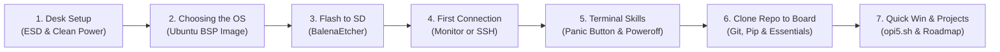
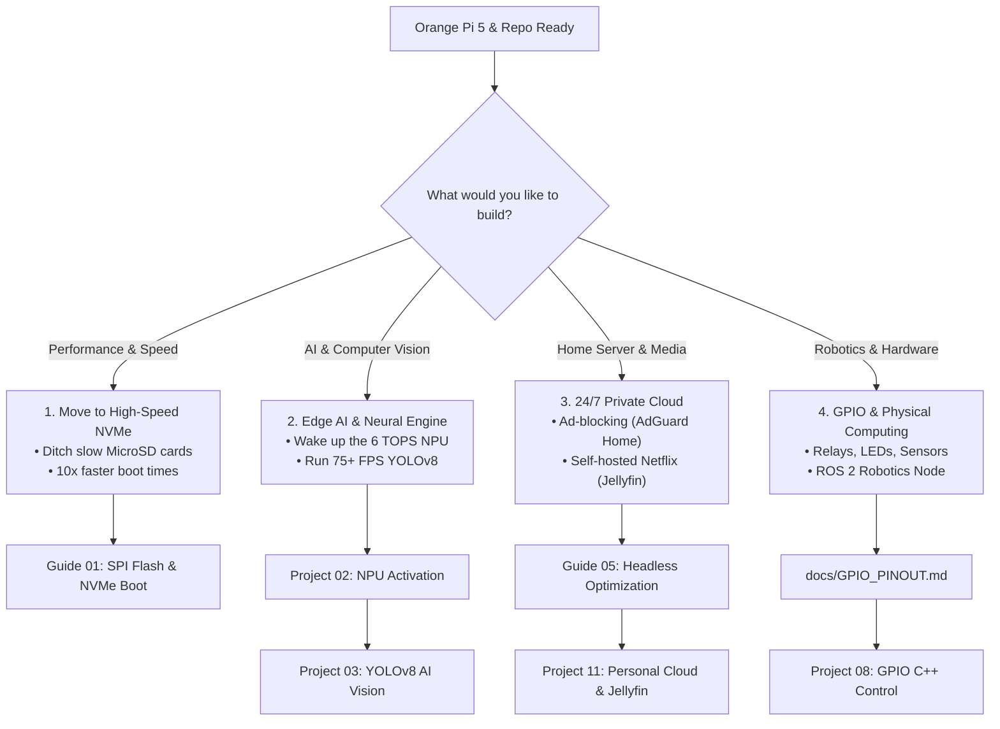

# **Zero to Hero Guide for Orange Pi 5: From Unboxing to Your First Project**

> **Who is this guide for?**  
> Anyone who has never used Linux before, has never opened a terminal (black command-line window), or is holding a Single-Board Computer (SBC) for the very first time. Without assuming any prior technical knowledge, this guide walks you from unboxing to running your first edge project.

---

## 🧭 Roadmap: Where We Start & Where We Are Going



---

## **Step 1: Unboxing – Preparing Your Desk & Hardware**

You are holding a bare green printed circuit board (PCB) populated with delicate surface-mount chips and exposed solder pads.

### 1. Electrostatic Discharge (ESD) Safety
* Do **not** place or power the board on carpets, wool blankets, or static-prone plastic surfaces.
* Keep the board resting on clean wood, cardboard, or the anti-static packaging box it arrived in.
* Never touch the header pins or bottom traces with bare fingers while the board is plugged in.

### 2. Power Supply: "Can I Use My Phone Charger?"
* **Strict Rule:** Do **not** use standard 5V/2A or 5V/3A mobile phone chargers. When the 8-core CPU spikes or an NVMe drive is accessed, standard phone chargers cause voltage drops (brownouts), triggering sudden shutdowns and reboots.
* **What You Need:** A dedicated **5V / 4A (20 Watt) fixed Type-C power adapter**.
* *(For full power and accessory details, see: [02. Hardware & Accessory Compatibility Guide](02-Hardware-and-Accessory-Compatibility.md))*.

### 3. Networking & Wi-Fi Notice
* **Important Fact:** The baseline Orange Pi 5 model **does NOT feature onboard Wi-Fi or Bluetooth**.
* To connect to the internet, you must plug a standard network cable into the **Gigabit Ethernet port** connected to your home router, or attach a Linux-compatible USB Wi-Fi dongle (e.g., RTL8821CU).

### 4. MicroSD Card Selection
* Use a high-quality MicroSD card (**32 GB or 64 GB minimum**) marked with an **A1** or **A2** application performance rating (e.g., SanDisk Extreme or Samsung EVO Plus).

---

## **Step 2: Operating System Selection (Escaping the Maze)**

When visiting the official Orange Pi download repository, you are confronted with a bewildering array of choices: *Android, OrangePi OS Arch, Droid, Debian, Ubuntu, OpenWRT*.

* **Recommended & Verified Distributions:**
  * **Ubuntu 24.04 LTS (Noble Numbat)** - Cutting-edge modern distribution (Joshua Riek 5.10 / 6.1 BSP Kernel).
  * **Ubuntu 22.04 LTS (Jammy Jellyfish)** - Industry standard long-term support (LTS).
* **"I Already Installed Ubuntu 24.04, Will I Face Any Issues?"**
  * **Absolutely not!** Every project, TUI tool (`opi5.sh`), diagnostic script (`check_health.sh`), NPU environment builder (`setup_npu.sh`), and Python RKNN package in this repository is **100% verified and compatible with both Ubuntu 24.04 and 22.04**. You do not need to reflash or downgrade your board.
* **The Only Critical Prerequisite:** Ensure your image is based on a **Rockchip BSP Kernel (5.10.x or 6.1.x)** (such as Joshua Riek's Ubuntu release or the official Orange Pi BSP). Upstream Mainline kernels (6.8+) lack in-tree NPU and VPU acceleration drivers.
* Download the image archive from official Orange Pi mirrors or Joshua Riek's GitHub releases, extract it, and prepare the `.img` file.

---

## **Step 3: Flashing the OS to MicroSD (3 Clicks)**

Download and install the free, cross-platform **BalenaEtcher** software on your computer (Windows or Mac):

1. Insert your MicroSD card into your computer via a USB card reader.
2. Launch BalenaEtcher:
   * **Flash from file:** Select your extracted `.img` file.
   * **Select target:** Choose your MicroSD card *(CAUTION: Double-check you are not selecting your computer's internal primary hard drive!)*.
   * **Flash!** Click the button to begin writing.
3. The writing and verification (checksum) process typically completes within 3 to 5 minutes. Eject the card safely.

---

## **Step 4: Booting Up & Your First Connection**

Insert the flashed MicroSD card into the slot on the underside of the Orange Pi 5 (metal pins facing inward). Connect your Ethernet cable, then plug in the 5V/4A Type-C power supply. The onboard red LED will illuminate solidly, and the green LED will begin blinking.

Choose one of two connection workflows:

### Option A: You Have a Monitor, Keyboard, and Mouse
1. Connect the board to your monitor via an HDMI cable.
2. Plug your keyboard and mouse into the USB ports.
3. The Ubuntu desktop GUI will appear directly on your display.

### Option B: You Don't Have a Monitor (Headless Laptop Connection)
This is the standard, professional method. Ensure your laptop and Orange Pi 5 are connected to the same home local network (router).

1. On your Windows PC, open **PowerShell** or **Command Prompt (CMD)**.
2. Type the following command and press `Enter`:
   ```bash
   ssh orangepi@orangepi5.local
   ```
   *(If `orangepi5.local` fails to resolve on your local router, open your router's web portal at `192.168.1.1` to locate the IP lease assigned to the board, e.g., `ssh orangepi@192.168.1.145`)*.
3. If prompted with `"Are you sure you want to continue connecting (yes/no)?"`, type `yes` and press Enter.
4. **When Prompted for Password:** Type `orangepi` and press Enter.  
   *(Security Note: Linux terminals intentionally suppress password characters; no asterisks `*` or letters will appear as you type. This is expected behavior—simply type the password and hit Enter).*

---

## **Step 5: First-Boot Maintenance (3 Essential Tasks)**

Once logged into your terminal, immediately run these three foundational tasks:

### 1. Update the Default Password
Secure your device on your home network:
```bash
passwd
```
Enter the current password (`orangepi`), then type your new password twice.

### 2. Update System Package Repositories
Synchronize software catalogs with upstream Ubuntu mirrors:
```bash
sudo apt update && sudo apt upgrade -y
```
*(When you see `sudo` at the beginning of a command, the system is executing the task with administrative "Superuser" privileges).*

### 3. Run the Hardware Health Diagnostic (Secure Local Execution)
Audit your board's subsystem health (CPU die temperatures, NPU character nodes, memory headroom) using our automated diagnostic utility:
```bash
# Security best practice: Download and run locally
curl -sSLO https://raw.githubusercontent.com/muhammetmucahitsoylu/orangepi5-tutorials/main/scripts/check_health.sh
bash check_health.sh
```
Your CPU die temperatures, NPU character nodes, and memory headroom will render on screen.

---

## **Step 6: Terminal Survival Kit & Panic Button**

The Linux terminal is simply a **file explorer without a mouse**.

### Essential File & Navigation Commands

| Command | Literal Meaning | What Does It Do? | Practical Example |
| :--- | :--- | :--- | :--- |
| `pwd` | *"Where am I?"* | Prints the full path of your current working directory. | `pwd` |
| `ls` | *"What is here?"* | Lists all files and subdirectories in the current folder. | `ls -la` (Includes hidden files) |
| `cd` | *"Change Directory"* | Navigates into another directory. | `cd Desktop` or go back up with `cd ..` |
| `mkdir` | *"Make Directory"* | Creates a new folder. | `mkdir MyProjects` |
| `nano` | *"Text Editor"* | Opens a terminal-based text editor for editing config or code files. | `nano test.txt` *(Save: `Ctrl+O`, Exit: `Ctrl+X`)* |
| `cat` | *"Concatenate"* | Prints the text contents of a file directly to the screen. | `cat /etc/os-release` |
| `htop` | *"Task Manager"* | Displays a real-time monitor of CPU, RAM, and background tasks. | `htop` *(Press `q` to quit)* |
| `sudo reboot` | *"Reboot Board"* | Gracefully restarts the operating system. | `sudo reboot` |
| `sudo poweroff` | *"Power Off"* | Safely shuts down the operating system. | `sudo poweroff` |

---

### 🚨 The Board Killer: NEVER Yank the Power Cable Directly!

> [!CAUTION]
> **Protect Your MicroSD Card and Filesystem:**  
> Never unplug the Type-C power cable while the board is running! Linux continually commits metadata writes to the storage medium. Pulling the plug abruptly causes EXT4 filesystem corruption, leaving your board unable to boot next time.  
> **The Safe Shutdown Sequence:**
> 1. In your terminal, run `sudo poweroff` and press Enter.
> 2. Wait for the green activity LED to completely turn off (approx. 10 seconds).
> 3. Once only the solid red LED remains, it is safe to unplug the power supply.

---

### 🛟 Terminal Panic Button (Lifesaving Reflexes)

| Key / Shortcut | What Does It Do? | Why It Saves Your Day |
| :--- | :--- | :--- |
| **`Ctrl + C`** | **Interrupt Process (Emergency Brake)** | If a command hangs, scrolls endlessly, or gets stuck in an infinite loop, press this to forcefully stop execution. |
| **`Ctrl + Shift + V`** | **Paste into Terminal** | Standard `Ctrl + V` does not work in Linux terminals! Use `Ctrl + Shift + V` or **right-click** your mouse to paste copied text. |
| **`TAB Key`** | **Autocompletion** | Never type long file paths by hand! For example, typing `cd or` and hitting `TAB` automatically expands to `cd orangepi5-tutorials/`. |
| **`Up Arrow (↑)`** | **Command History** | Instead of retyping commands, press the Up Arrow to cycle through previously executed commands. |
| **`clear` or `Ctrl + L`** | **Clear Terminal Screen** | Wipes terminal clutter and resets your viewport to a clean prompt. |

---

## **Step 7: Developer Essentials & Cloning This Repository to Your Board**

To run the AI, camera, and home server projects on your board, you must install the fundamental developer packages and clone this repository directly onto the device:

### 1. Install Essential Tooling
Execute this command to install Git, Python, virtual environment tooling, and build compilers:
```bash
sudo apt update && sudo apt install -y git python3-pip python3-venv build-essential
```

> [!TIP]
> **Pro-Tip for Ubuntu 24.04 Users (Python 3.12 & PEP 668):**  
> Ubuntu 24.04 ships with Python 3.12, which enforces managed environments (`externally-managed-environment`).  
> When running projects, create an isolated virtual environment with `python3 -m venv ~/rknn_env && source ~/rknn_env/bin/activate`, or simply run our automated `scripts/setup_npu.sh` script, which installs the matching Python 3.12 wheel (`cp312`) and virtual environment automatically.

### 2. Clone This Tutorial Repository
Download all source codes, models, and scripts directly to your board:
```bash
git clone https://github.com/muhammetmucahitsoylu/orangepi5-tutorials.git
cd orangepi5-tutorials
```
You are now situated in `/home/orangepi/orangepi5-tutorials`; every project, script, and guide is directly accessible on your board!

---

## **Step 8: Your First Quick Win (Interactive Telemetry Dashboard)**

To verify that your board and this repository are running in complete harmony, launch our interactive terminal control center:

```bash
bash scripts/opi5.sh
```

A sleek ASCII dashboard and menu will launch:
* Press **`1`** to run a comprehensive hardware health check.
* Press **`4`** to monitor real-time CPU core frequencies and thermal sensors.
* Press **`0`** to exit back to the shell prompt.

> [!TIP]
> **Pro Tip: Escape Nano with VS Code Remote - SSH**  
> You don't have to write code inside a raw terminal!  
> 1. Install the free [Visual Studio Code](https://code.visualstudio.com/) on your laptop (Windows or Mac).  
> 2. Install the **"Remote - SSH"** extension by Microsoft from the Extensions tab.  
> 3. Click the bottom-left blue `><` button, select **"Connect to Host..."**, and enter `orangepi@orangepi5.local`.  
> 4. Enter your password, then choose **"Open Folder"** and select `/home/orangepi/orangepi5-tutorials`.  
> You now enjoy a desktop file explorer, syntax coloring, drag-and-drop file transfers, and an integrated terminal!  
> *(For step-by-step setup details, see: [01. IDE & Dev Environment Guide](../../projects/English/01-IDE-and-Dev-Environment.md))*.

---

## **Step 9: Where to Go Next? (Choose Your Path)**

Congratulations! You have configured your hardware, established a stable network shell, mastered basic terminal commands, and cloned this repository to your board. You are now ready to jump straight into any project:



### 🔗 Quick Links to Next Projects:
* **For IDE & Setup:** [01. IDE & Development Environment Setup](../../projects/English/01-IDE-and-Dev-Environment.md)
* **For Speed & Storage:** [01. SPI Flash & NVMe Boot Installation Guide](01-Recovery-and-NVMe-Installation.md)
* **For Edge AI:** [02. NPU Activation & RKNN Runtime Setup](../../projects/English/02-NPU-Activation-and-RKNN.md)
* **For Object Detection:** [03. YOLOv8 Edge AI Inference on NPU](../../projects/English/03-YOLOv8-NPU-Inference.md)
* **For Private Cloud & Media:** [11. Personal Cloud & Jellyfin Media Server](../../projects/English/11-Personal-Cloud-Jellyfin.md)
* **For Hardware Pins:** [26-Pin GPIO Header Reference & Pinout Guide](../../docs/GPIO_PINOUT.md)
* **For GPIO Control:** [08. Hardware Control with GPIO & C++](../../projects/English/08-Hardware-Control-GPIO-Cpp.md)
