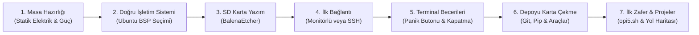
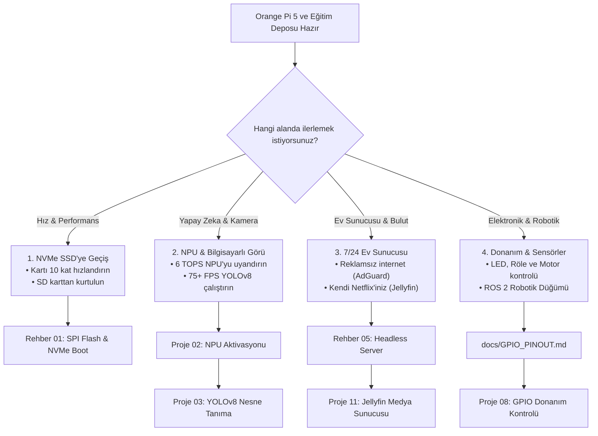

# **0'dan Başlayanlar İçin Orange Pi 5 Rehberi: Kutudan Projeye Adım Adım Yolculuk**

> 🛡️ **Doğrulandı & Test Edildi:** Bu rehberdeki tüm adımlar ve komutlar **Orange Pi 5 (RK3588S) + Ubuntu 24.04 LTS / 22.04 LTS (Rockchip BSP Kernel 5.10 / 6.1)** üzerinde bizzat fiziksel donanımda test edilmiş ve onaylanmıştır.

> **Bu kılavuz kimler içindir?**  
> Hayatında hiç Linux kullanmamış, terminal (siyah ekran) görmemiş ya da eline ilk defa bir Tek Kart Bilgisayar (SBC) almış herkes için hazırlanmıştır. Hiçbir teknik jargon varsayılmadan, kutu açılışından ilk projenizi çalıştırmaya kadar adım adım rehberlik eder.

---

## 🧭 Genel Bakış: Nereden Başlayıp Nereye Gideceğiz?



---

## **Adım 1: Kutuyu Açtınız – Masayı ve Donanımı Hazırlayın**

Elinizde mavi renkli, üzerinde yüzlerce minik bileşen, çip ve lehim bulunan hassas bir elektronik kart var.

<p align="center">
  
  
  <br>
  <em>🔍 <strong>Donanım Mimarisi:</strong> Kart üzerindeki tüm portlar, çipler, butonlar (MaskROM, Recovery), UART ve M.2 NVMe yuvası yukarıdaki yüksek çözünürlüklü fotoğraflarda oklarla etiketlenmiştir.</em>
</p>

### 1. Statik Elektrikten Koruma
* Kartı yün kazak, halı veya battaniye üzerinde çalıştırmayın.
* Masanın üzerine tahta, karton veya kartın kendi kutusunu koyun; kartı bunun üzerinde tutun.
* Kart çalışırken altındaki veya üstündeki metal pinlere çıplak elle dokunmayın (kısa devre riskini önler).

### 2. Güç Kaynağı: "Telefon Şarj Aletim Olur mu?"
* **Kesin Kural:** Standart 5V/2A veya 5V/3A telefon şarj aletlerini **kullanmayın**. Kart masaüstünü açarken veya işlemciye yük bindiğinde aniden kapanır ya da kendini yeniden başlatır (brownout arızası).
* **İhtiyacınız Olan:** **5V / 4A (20 Watt) sabit Type-C güç adaptörü.**
* *(Daha fazla detay için: [02. Donanım & Aksesuar Uyumluluk Kılavuzu](02-Donanim-ve-Aksesuar-Uyumluluk.md))*.

### 3. İnternet ve Wi-Fi Uyarısı
* **Önemli Gerçek:** Standart Orange Pi 5 modelinde **dahili Wi-Fi veya Bluetooth YOKTUR**.
* İnternete bağlanabilmek için kartın üzerindeki **Gigabit Ethernet portuna** evinizdeki modemin kablosunu takmanız gerekir (veya uyumlu bir USB Wi-Fi adaptörü takmalısınız).

### 4. Hafıza Kartı (MicroSD)
* En az **32 GB veya 64 GB**, üzerinde **A1** veya **A2** (Application Performance Class) simgesi olan kaliteli bir MicroSD kart edinin (SanDisk Ultra/Extreme veya Samsung EVO Plus önerilir).

---

## **Adım 2: İşletim Sistemi Seçimi (Labirentten Kurtulun)**

Orange Pi indirme kaynaklarına gittiğinizde karşınıza *Android, OrangePi OS Arch, Droid, Debian, Ubuntu* gibi onlarca seçenek çıkar.

* **Önerilen & Doğrulanmış Dağıtımlar:**
  * **Ubuntu 24.04 LTS (Noble Numbat)** - En güncel modern dağıtım (Joshua Riek 5.10 / 6.1 BSP Kernel).
  * **Ubuntu 22.04 LTS (Jammy Jellyfish)** - Endüstri standardı uzun süreli destek (LTS).
* **"Benim Kartımda Ubuntu 24.04 Kurulu, Sorun Yaşar mıyım?"**
  * **Kesinlikle hayır!** Depomuzdaki tüm projeler, TUI araçları (`opi5.sh`), donanım teşhis betikleri (`check_health.sh`), NPU kurulum otomasyonu (`setup_npu.sh`) ve Python RKNN paketleri **hem Ubuntu 24.04 hem de 22.04 ile %100 uyumlu** çalışacak şekilde optimize edilmiştir. Sisteminizi sıfırlamanıza veya 22.04'e düşürmenize kesinlikle gerek yoktur.
* **Hayati Öneme Sahip Tek Kural:** İndirdiğiniz imajın **Rockchip BSP Kernel (5.10.x veya 6.1.x)** tabanlı olmasıdır (Joshua Riek veya resmi Orange Pi imajı). Mainline (çekirdek 6.8+) genel imajlarda NPU ve VPU donanım hızlandırma sürücüleri bulunmaz.
* İmajı resmi Orange Pi sitesinden veya Joshua Riek GitHub deposundan indirip arşivden çıkararak `.img` dosyasını elde edin.

---

## **Adım 3: İmajı Hafıza Kartına Yazma (3 Tıkla)**

Bilgisayarınıza (Windows veya Mac) ücretsiz **BalenaEtcher** programını kurun:

1. MicroSD kartınızı bir kart okuyucu ile bilgisayarınıza takın.
2. BalenaEtcher uygulamasını açın:
   * **Flash from file:** İndirdiğiniz `.img` dosyasını seçin.
   * **Select target:** MicroSD kartınızı seçin *(DİKKAT: Bilgisayarınızın kendi sabit diskini seçmediğinizden emin olun)*.
   * **Flash!** butonuna tıklayın.
3. Yazma ve doğrulama işlemi (Validate) 3-5 dakika içinde biter. Kartı bilgisayardan çıkarın.

---

## **Adım 4: Kartı Başlatma ve İlk Bağlantı**

MicroSD kartı Orange Pi 5'in altındaki yuvaya (metal dişleri içe bakacak şekilde) yerleştirin. Ethernet kablosunu takın ve Type-C güç kablosunu bağlayın. Kartın üzerindeki kırmızı LED sabit yanacak, yeşil LED yanıp sönmeye başlayacaktır.

İki bağlantı yönteminden birini seçin:

### Seçenek A: Monitörünüz, Klavyeniz ve Fareniz Varsa
1. HDMI kablosu ile kartı monitörünüze bağlayın.
2. USB portlarına klavye ve farenizi takın.
3. Ekrana doğrudan Ubuntu masaüstü gelecektir.

### Seçenek B: Monitörünüz Yoksa (Laptop Üzerinden "Ekransız / Headless" Bağlantı)
Bu en yaygın ve profesyonel yöntemdir. Laptopunuzla Orange Pi 5 aynı modeme bağlı olsun.

1. Windows bilgisayarınızda **PowerShell** veya **CMD** (Komut İstemi) uygulamasını açın.
2. Şu komutu yazıp `Enter`a basın:
   ```bash
   ssh orangepi@orangepi5.local
   ```
   *(Eğer `orangepi5.local` bulunamazsa, evinizin modem arayüzüne `192.168.1.1` girip "Bağlı Cihazlar" listesinden Orange Pi'nin aldığı IP adresini bulun; örn: `ssh orangepi@192.168.1.145`)*.
3. Ekrana `"Are you sure you want to continue connecting (yes/no)?"` sorusu gelirse `yes` yazıp Enter'a basın.
4. **Şifre Sorulduğunda:** Şifre olarak `orangepi` yazın ve Enter'a basın.  
   *(Güvenlik gereği Linux'ta şifre yazarken ekranda yıldız `*` veya harf görünmez, imleç hareket etmez; bu normaldir, şifrenizi yazıp doğrudan Enter'a basın).*

---

## **Adım 5: İlk Açılış Hijyeni (Mutlaka Yapılması Gereken 3 Şey)**

Terminal ekranına bağlandığınızda ilk olarak şu 3 adımı gerçekleştirin:

### 1. Varsayılan Şifrenizi Değiştirin
Kartınızın ağda güvenli kalması için şifrenizi güncelleyin:
```bash
passwd
```
Önce mevcut şifrenizi (`orangepi`), ardından 2 kez belirleyeceğiniz yeni şifrenizi girin.

### 2. Sistemi Güncelleyin
Uygulama havuzlarını en güncel sürümlerle tazeleyin:
```bash
sudo apt update && sudo apt upgrade -y
```
*(Komutun başında `sudo` gördüğünüzde, sistem sizden şifrenizi isteyebilir. Bu, "Yönetici olarak çalıştır" anlamına gelir).*

### 3. Donanım Sağlığını Kontrol Edin (Güvenli Yerel Çalıştırma)
Otomatik donanım denetim betiğimizi indirip çalıştırarak kartın tüm bileşenlerini (CPU sıcaklığı, NPU sürücüsü, bellek durumu) tek ekranda denetleyin:
```bash
# Güvenlik en iyi pratiği: Betiği yerel olarak indirin ve çalıştırın
curl -sSLO https://raw.githubusercontent.com/muhammetmucahitsoylu/orangepi5-tutorials/main/scripts/check_health.sh
bash check_health.sh
```
Ekranda işlemci sıcaklığı, NPU sürücüsü ve bellek durumu yeşil renklerle dökülecektir.

---

## **Adım 6: Linux Terminalinde Hayatta Kalma Çantası & Panik Butonu**

Terminalden korkmanıza gerek yok; terminal sadece **farenin olmadığı bir dosya yöneticisidir**.

### Temel Dosya ve Gezinme Komutları

| Komut | Türkçe Karşılığı | Ne İşe Yarar? | Örnek Kullanım |
| :--- | :--- | :--- | :--- |
| `pwd` | *"Neredeyim?"* | Şu an içinde bulunduğunuz klasörün tam yolunu ekrana basar. | `pwd` |
| `ls` | *"Burada ne var?"* | Bulunduğunuz klasördeki dosya ve klasörleri listeler. | `ls -la` (Gizli dosyaları da gösterir) |
| `cd` | *"Klasöre gir"* | Başka bir klasörün içine geçmenizi sağlar. | `cd Desktop` veya bir üst klasöre çıkmak için `cd ..` |
| `mkdir` | *"Yeni klasör aç"* | Yeni bir klasör oluşturur. | `mkdir Projelerim` |
| `nano` | *"Not Defteri"* | Terminal içinde metin veya kod dosyası açıp düzenler. | `nano test.txt` *(Kaydetmek: `Ctrl + O`, Çıkmak: `Ctrl + X`)* |
| `cat` | *"İçeriği oku"* | Bir dosyanın içini terminale döker. | `cat /etc/os-release` |
| `htop` | *"Görev Yöneticisi"* | Hangi programın ne kadar CPU ve RAM harcadığını gösterir. | `htop` *(Çıkmak için `q` tuşu)* |
| `sudo reboot` | *"Yeniden Başlat"* | Kartı güvenli şekilde yeniden başlatır. | `sudo reboot` |
| `sudo poweroff` | *"Sistemi Kapat"* | Kartı güvenli bir şekilde kapatır. | `sudo poweroff` |

---

### 🚨 Kartın Katili: Fişi ASLA Doğrudan Çekmeyin!

> [!CAUTION]
> **MicroSD Kartınızı ve Sisteminizi Korumak İçin:**  
> İşi bitirince Type-C güç kablosunu doğrudan prizden çekmeyin! Linux arka planda diske sürekli veri yazar. Aniden güç kesilirse MicroSD kartın dosya sistemi bozulur (corruption) ve ertesi gün kartınız açılmaz.  
> **Doğru Kapatma Yöntemi:**
> 1. Terminalde `sudo poweroff` yazıp Enter'a basın.
> 2. Yeşil aktivite LED ışığının tamamen sönmesini (yaklaşık 10 saniye) bekleyin.
> 3. Yalnızca kırmızı LED kaldığında güç fişini güvenle çekebilirsiniz.

---

### 🛟 Terminal Panik Butonu (Hayat Kurtaran Refleksler)

| Kısayol / Tuş | Ne İşe Yarar? | Neden Hayat Kurtarır? |
| :--- | :--- | :--- |
| **`Ctrl + C`** | **İşlemi Anında Durdur (Acil Fren)** | Bir komut takılırsa, ekranda sürekli yazılar akarsa veya program sonsuz döngüye girerse basıp zorla durdurun. |
| **`Ctrl + Shift + V`** | **Terminale Yapıştır** | Windows'taki normal `Ctrl + V` Linux terminalinde çalışmaz! Kopyaladığınız bir komutu yapıştırmak için `Ctrl + Shift + V` kullanın ya da terminale **sağ tıklayın**. |
| **`TAB Tuşu`** | **Otomatik Tamamlama** | Asla uzun dosya yollarını harf harf yazmayın! Örneğin `cd or` yazıp `TAB` tuşuna bastığınızda terminal onu otomatik olarak `cd orangepi5-tutorials/` yapar. |
| **`Yukarı Ok (↑)`** | **Önceki Komutları Çağır** | Daha önce yazdığınız komutları tekrar yazmak yerine yukarı ok tuşuna basarak geçmiş komutlar arasında gezinebilirsiniz. |
| **`clear` veya `Ctrl + L`** | **Ekranı Temizle** | Terminal yazılarla dolup gözünüz yorulduğunda ekranı tertemiz yapar. |

---

## **Adım 7: Geliştirici Paketleri & Eğitim Deposunu Karta İndirme**

Bu depodaki yapay zeka, kamera ve sunucu projelerini kartınızda çalıştırabilmek için temel geliştirme araçlarını kurup projeleri kartın içine çekmemiz gerekir:

### 1. Temel Geliştirici Paketlerini Kurun
Terminalde şu komutu çalıştırarak Git, Python ve derleme araçlarını yükleyin:
```bash
sudo apt update && sudo apt install -y git python3-pip python3-venv build-essential
```

> [!TIP]
> **Ubuntu 24.04 Kullanıcıları İçin Python (PEP 668) İpucu:**  
> Ubuntu 24.04 varsayılan olarak Python 3.12 ile gelir ve sistem genelinde `pip install` komutunu sınırlar (`externally-managed-environment`).  
> Projeleri çalıştırırken `python3 -m venv ~/rknn_env && source ~/rknn_env/bin/activate` ile izole bir sanal ortam oluşturabilir veya depomuzdaki `scripts/setup_npu.sh` betiğini çalıştırabilirsiniz; betik Python 3.12 uyumlu wheel paketini (`cp312`) ve sanal ortamı sizin yerinize tek tıkla otomatik kurar.

### 2. Bu Depoyu Kartınıza Klonlayın (İndirin)
Tüm kaynak kodların, modellerin ve projelerin kartınızda hazır bulunması için depoyu klonlayın:
```bash
git clone https://github.com/muhammetmucahitsoylu/orangepi5-tutorials.git
cd orangepi5-tutorials
```
Artık kartınızın içinde `~/orangepi5-tutorials` (veya `/home/<kullanici_adiniz>/orangepi5-tutorials`) klasöründesiniz; tüm projeler ve rehberler parmaklarınızın ucunda!

---

## **Adım 8: İlk Hızlı Zafer (Quick Win: İnteraktif Kontrol Paneli)**

Kartınızın kusursuz çalıştığını kendi gözlerinizle görmek için hazırladığımız interaktif kontrol merkezini başlatın:

```bash
bash scripts/opi5.sh
```

Ekrana etkileyici bir terminal menüsü gelecektir:
* **`1`** tuşuna basarak tam donanım sağlığı denetimi yapın.
* **`4`** tuşuna basarak NVMe SSD / depolama biriminizin gerçek okuma/yazma hızını test edin.
* **`5`** tuşuna basarak 6 TOPS Yapay Zeka (NPU) hızlandırıcısını kendi kendine test edin.
* **`7`** tuşuna basarak 8 çekirdekli Rockchip işlemcinizin sıcaklık ve frekanslarını canlı izleyin.
* Menüden çıkmak için **`0`** tuşuna basın.

> [!TIP]
> **Pro İpucu: Nano Eziyetinden Kurtulun (VS Code Remote - SSH)**  
> Terminal ekranında yüzlerce satır kod düzenlemek zorunda değilsiniz!  
> 1. Kendi bilgisayarınıza (Windows/Mac) ücretsiz **Visual Studio Code** kurun.  
> 2. Sol menüdeki Eklentiler (Extensions) bölümünden **"Remote - SSH"** (Microsoft) eklentisini yükleyin.  
> 3. Sol alttaki mavi `><` ikonuna tıklayıp **"Connect to Host..."** deyin ve `orangepi@orangepi5.local` yazın.  
> 4. Şifrenizi girdikten sonra "Open Folder" diyerek `/home/orangepi/orangepi5-tutorials` klasörünü açın.  
> *(Detaylı adım adım kurulum için rehberimiz: [01. Yazılımcılar İçin IDE ve Geliştirme Ortamı](../../projects/Turkish/01-IDE-ve-Gelistirme-Ortami.md))*.

---

## **Adım 9: Şimdi Nereye? (Kendi Yolunuzu Seçin)**

Tebrikler! Kartınızı başarıyla kurdunuz, ağa bağladınız, temel Linux komutlarını öğrendiniz ve bu eğitim deposunu kartınıza indirdiniz. Artık kartınızdaki `/home/orangepi/orangepi5-tutorials` klasöründen istediğiniz projeye doğrudan geçebilirsiniz:



### 🔗 İlgili Sonraki Adım Bağlantıları:
* **Geliştirme Ortamı İçin:** [01. IDE ve Geliştirme Ortamı Kurulumu](../../projects/Turkish/01-IDE-ve-Gelistirme-Ortami.md)
* **Hız ve Depolama İçin:** [01. SPI Flash & NVMe Boot Kurulum Kılavuzu](01-Kurtarma-ve-NVMe-Kurulum.md)
* **Yapay Zeka İçin:** [02. NPU Aktivasyonu ve RKNN Çalışma Ortamı](../../projects/Turkish/02-NPU-Aktivasyonu-ve-RKNN.md)
* **Nesne Tanıma İçin:** [03. YOLOv8 ile NPU Üzerinde Nesne Tespiti](../../projects/Turkish/03-YOLOv8-NPU-Cikarimi.md)
* **Kişisel Bulut & Sunucu İçin:** [11. Kişisel Bulut ve Jellyfin Medya Sunucusu](../../projects/Turkish/11-Kisisel-Bulut-Jellyfin.md)
* **Pin Bağlantıları İçin:** [26-Pin GPIO Donanım Şeması](../../docs/GPIO_PINOUT.md)
* **GPIO Donanım Kontrolü İçin:** [08. GPIO ve Donanım Kontrolü](../../projects/Turkish/08-GPIO-ve-Donanim-Kontrolu.md)
