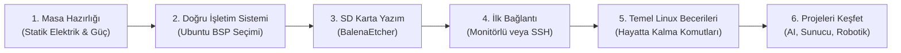
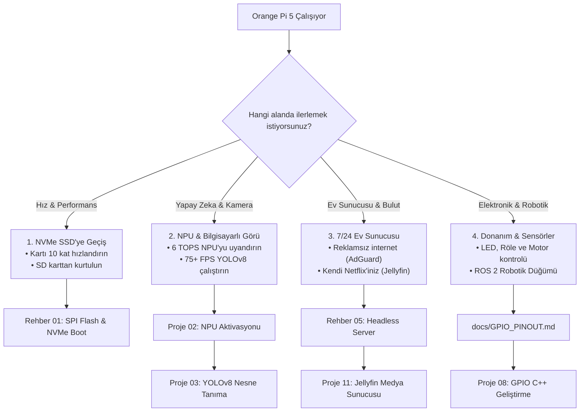

# **0'dan Başlayanlar İçin Orange Pi 5 Rehberi: Kutudan Projeye Adım Adım Yolculuk**

> **Bu kılavuz kimler içindir?**  
> Hayatında hiç Linux kullanmamış, terminal (siyah ekran) görmemiş ya da eline ilk defa bir Tek Kart Bilgisayar (SBC) almış herkes için hazırlanmıştır. Hiçbir teknik jargon varsayılmadan, kutu açılışından ilk projenizi çalıştırmaya kadar adım adım rehberlik eder.

---

## 🧭 Genel Bakış: Nereden Başlayıp Nereye Gideceğiz?



---

## **Adım 1: Kutuyu Açtınız – Masayı ve Donanımı Hazırlayın**

Elinizde yeşil renkli, üzerinde yüzlerce minik bileşen ve lehim bulunan hassas bir elektronik kart var.

### 1. Statik Elektrikten Koruma
* Kartı yün kazak, halı veya battaniye üzerinde çalıştırmayın.
* Masanın üzerine tahta, karton veya kartın kendi kutusunu koyun; kartı bunun üzerinde tutun.
* Kart çalışırken altındaki veya üstündeki metal pinlere çıplak elle dokunmayın (kısa devre riskini önler).

### 2. Güç Kaynağı: "Telefon Şarj Aletim Olur mu?"
* **Kesin Kural:** Standart 5V/2A veya 5V/3A telefon şarj aletlerini **kullanmayın**. Kart masaüstünü açarken veya işlemciye yük bindiğinde aniden kapanır ya da kendini yeniden başlatır (brownout arızası).
* **İhtiyacınız Olan:** **5V / 4A (20 Watt) sabit Type-C güç adaptörü.**
* *(Daha fazla detay için: [02. Donanım & Aksesuar Uyumluluk Kılavuzu](02-Donanim-ve-Aksesuar-Uyumluluk.md))*.

### 3. İnternet ve Wi-Fi Uyarısı
* **Önemli Gerçek:** Standart Orange Pi 5 modelinde **dahili Wi-Fi veya Bluetooth YOKTUR**.
* İnternete bağlanabilmek için kartın üzerindeki **Gigabit Ethernet portuna** evinizdeki modemin kablosunu takmanız gerekir (veya uyumlu bir USB Wi-Fi adaptörü takmalısınız).

### 4. Hafıza Kartı (MicroSD)
* En az **32 GB veya 64 GB**, üzerinde **A1** veya **A2** (Application Performance Class) simgesi olan kaliteli bir MicroSD kart edinin (SanDisk Ultra/Extreme veya Samsung EVO Plus önerilir).

---

## **Adım 2: İşletim Sistemi Seçimi (Labirentten Kurtulun)**

Orange Pi resmi indirme sitesine gittiğinizde karşınıza *Android, OrangePi OS Arch, Droid, Debian, Ubuntu* gibi onlarca seçenek çıkar.

* **Bizim Seçimimiz:** **Ubuntu 22.04 LTS Desktop (Kernel 5.10 veya 6.1 BSP)**.
* **Neden?** Yapay zeka (NPU), video hızlandırma (VPU) ve bu depodaki 13 projenin tamamı bu Linux sürümüne göre optimize edilmiştir.
* Resmi Orange Pi sitesinden veya Armbian sayfasından `.img.xz` veya `.7z` uzantılı Ubuntu imajını bilgisayarınıza indirin ve arşivden çıkararak `.img` dosyasını elde edin.

---

## **Adım 3: İmajı Hafıza Kartına Yazma (3 Tıkla)**

Bilgisayarınıza (Windows veya Mac) ücretsiz **BalenaEtcher** programını kurun:

1. MicroSD kartınızı bir kart okuyucu ile bilgisayarınıza takın.
2. BalenaEtcher uygulamasını açın:
   * **Flash from file:** İndirdiğiniz `.img` dosyasını seçin.
   * **Select target:** MicroSD kartınızı seçin *(DİKKAT: Bilgisayarınızın kendi sabit diskini seçmediğinizden emin olun)*.
   * **Flash!** butonuna tıklayın.
3. Yazma ve doğrulama işlemi (Validate) 3-5 dakika içinde biter. Kartı bilgisayardan çıkarın.

---

## **Adım 4: Kartı Başlatma ve İlk Bağlantı**

MicroSD kartı Orange Pi 5'in altındaki yuvaya (metal dişleri içe bakacak şekilde) yerleştirin. Ethernet kablosunu takın ve Type-C güç kablosunu bağlayın. Kartın üzerindeki kırmızı LED sabit yanacak, yeşil LED yanıp sönmeye başlayacaktır.

İki bağlantı yönteminden birini seçin:

### Seçenek A: Monitörünüz, Klavyeniz ve Fareniz Varsa
1. HDMI kablosu ile kartı monitörünüze bağlayın.
2. USB portlarına klavye ve farenizi takın.
3. Ekrana doğrudan Ubuntu masaüstü gelecektir.

### Seçenek B: Monitörünüz Yoksa (Laptop Üzerinden "Ekransız / Headless" Bağlantı)
Bu en yaygın ve profesyonel yöntemdir. Laptopunuzla Orange Pi 5 aynı modeme bağlı olsun.

1. Windows bilgisayarınızda **PowerShell** veya **CMD** (Komut İstemi) uygulamasını açın.
2. Şu komutu yazıp `Enter`a basın:
   ```bash
   ssh orangepi@orangepi5.local
   ```
   *(Eğer `orangepi5.local` bulunamazsa, evinizin modem arayüzüne `192.168.1.1` girip "Bağlı Cihazlar" listesinden Orange Pi'nin aldığı IP adresini bulun; örn: `ssh orangepi@192.168.1.145`)*.
3. Ekrana `"Are you sure you want to continue connecting (yes/no)?"` sorusu gelirse `yes` yazıp Enter'a basın.
4. **Şifre Sorulduğunda:** Şifre olarak `orangepi` yazın ve Enter'a basın.  
   *(Güvenlik gereği Linux'ta şifre yazarken ekranda yıldız `*` veya harf görünmez, imleç hareket etmez; bu normaldir, şifrenizi yazıp doğrudan Enter'a basın).*

---

## **Adım 5: İlk Açılış Hijyeni (Mutlaka Yapılması Gereken 3 Şey)**

Terminal ekranına bağlandığınızda ilk olarak şu 3 adımı gerçekleştirin:

### 1. Varsayılan Şifrenizi Değiştirin
Kartınızın ağda güvenli kalması için şifrenizi güncelleyin:
```bash
passwd
```
Önce mevcut şifrenizi (`orangepi`), ardından 2 kez belirleyeceğiniz yeni şifrenizi girin.

### 2. Sistemi Güncelleyin
Uygulama havuzlarını en güncel sürümlerle tazeleyin:
```bash
sudo apt update && sudo apt upgrade -y
```
*(Komutun başında `sudo` gördüğünüzde, sistem sizden şifrenizi isteyebilir. Bu, "Yönetici olarak çalıştır" anlamına gelir).*

### 3. Donanım Sağlığını Kontrol Edin (Tek Komutla)
Bizim hazırladığımız otomatik donanım denetim scriptini çalıştırarak kartın tüm parçalarını tek ekranda görün:
```bash
curl -sSL https://raw.githubusercontent.com/muhammetmucahitsoylu/orangepi5-tutorials/main/scripts/check_health.sh | bash
```
Ekranda işlemci sıcaklığı, NPU sürücüsü ve bellek durumu yeşil renklerle dökülecektir.

---

## **Adım 6: Linux Terminalinde Hayatta Kalma Çantası (İlk 8 Komut)**

Terminalden korkmanıza gerek yok; terminal sadece **farenin olmadığı bir dosya yöneticisidir**.

| Komut | Türkçe Karşılığı | Ne İşe Yarar? | Örnek Kullanım |
| :--- | :--- | :--- | :--- |
| `pwd` | *"Neredeyim?"* | Şu an içinde bulunduğunuz klasörün yolunu ekrana basar. | `pwd` |
| `ls` | *"Burada ne var?"* | Bulunduğunuz klasördeki dosya ve klasörleri listeler. | `ls -la` (Gizli dosyaları da gösterir) |
| `cd` | *"Klasöre gir"* | Başka bir klasörün içine geçmenizi sağlar. | `cd Desktop` veya bir üst klasöre çıkmak için `cd ..` |
| `mkdir` | *"Yeni klasör aç"* | Yeni bir klasör oluşturur. | `mkdir Projelerim` |
| `nano` | *"Not Defteri"* | Terminal içinde metin veya kod dosyası açıp düzenler. | `nano test.txt` *(Kaydetmek için `Ctrl + O`, çıkmak için `Ctrl + X`)* |
| `cat` | *"İçeriği oku"* | Bir dosyanın içini terminale döker. | `cat /etc/os-release` |
| `htop` | *"Görev Yöneticisi"* | Hangi programın ne kadar CPU ve RAM harcadığını gösterir. | `htop` *(Çıkmak için `q` tuşu)* |
| `sudo reboot` | *"Yeniden Başlat"* | Kartı güvenli şekilde yeniden başlatır. | `sudo reboot` |

---

## **Adım 7: Şimdi Nereye? (Kendi Yolunuzu Seçin)**

Tebrikler! Kartınızı başarıyla kurdunuz, ağa bağladınız ve temel Linux mantığını kavradınız. Artık bu depodaki ileri düzey kılavuz ve projelere geçmeye tamamen hazırsınız:



### 🔗 İlgili Sonraki Adım Bağlantıları:
* **Hız ve Depolama İçin:** [01. SPI Flash & NVMe Boot Kurulum Kılavuzu](01-Kurtarma-ve-NVMe-Kurulum.md)
* **Yapay Zeka İçin:** [02. NPU Aktivasyonu ve RKNN Çalışma Ortamı](../../projects/Turkish/02-NPU-Aktivasyonu-ve-RKNN.md)
* **Kişisel Bulut & Sunucu İçin:** [11. Kişisel Bulut ve Jellyfin Medya Sunucusu](../../projects/Turkish/11-Kisisel-Bulut-Jellyfin.md)
* **Pin Bağlantıları İçin:** [26-Pin GPIO Donanım Şeması](../../docs/GPIO_PINOUT.md)
